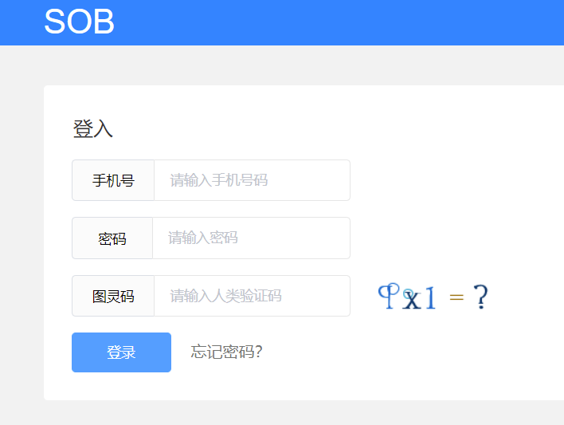

## 前言

项目地址：https://github.com/cctyl/sunofbeach_mobile.git

这期也是后来补上的，写到login页面真的不想重写了，这部分内容好多啊


## 分析

这个登录页面，需要长什么样，要有什么属性来登录？首先，参考csdn怎么写的

 

再看看知乎怎么写的

 


大概样式，咱们心里有底了。接下来看看sob的登录，需要哪些属性。

 


共需要手机号，密码，验证码等。

基于上面的分析，我们准备这么设计

- 顶部需要一个导航栏，用于返回首页
- 一个logo
- 一个登录表单，包含手机号，密码，验证码
- 忘记密码，去注册等功能栏
- 版权声明

最终设计如下：

 


## 实现

- 导航栏，采用nutui的导航栏，咱们复制过来改一改就行

  - ```html
    <!--导航栏-->
    <nut-navbar
            @on-click-back="back"
            :leftShow="true"
            :right-show="false"
    >
        登录
    </nut-navbar>
    ```

- logo

  logo，就是一串普通的文件，但是把他放大了，并且改变了颜色，这部分主要是css样式的调整


- 表单

  表单里放上三个输入框，一个按钮。

  其中输入框，直接使用nutui的输入组件

  对于验证码，实际就是一张图片，直接把图片的src 换成验证码接口`https://api.sunofbeach.net/uc/ut/captcha`

- 忘记密码，注册等按钮，就是一个文本，加了颜色和点击事件，用flex布局让它们分布在左右两侧，剩下的就是调整css样式

- 版权信息

  其实就是普通的两串文本，把字体样式调整一下即可


## 代码

结构：

```html
<template>
    <div>

        <!--导航栏-->
        <nut-navbar
                @on-click-back="back"
                :leftShow="true"
                :right-show="false"
        >
            登录
        </nut-navbar>
        <!--标题-->
        <h1 class="title">SOB</h1>
        <!--表单-->
        <div class="loginform">

            <form @submit.prevent="login">

                <nut-textinput
                        v-model="loginFrom.phone"
                        placeholder="请输入手机号"
                        maxlength="11"
                        :clearBtn="true"
                        :disabled="false"
                />

                <nut-textinput
                        placeholder="请输入密码"
                        v-model="loginFrom.password"
                        type="password"
                />

                <nut-row>
                    <nut-col :span="15">
                        <nut-textinput
                                class="captchaInput"
                                v-model="loginFrom.captcha"
                                placeholder="请输入验证码"
                                :clearBtn="true"
                                :disabled="false"
                        />
                    </nut-col>
                    <nut-col :span="9">
                        
                    </nut-col>
                </nut-row>

                <div class="loginbtn">
                    <!--按钮-->

                    <button type="submit">登录</button>
                </div>


            </form>


        </div>
        <!--其他信息-->
        <div class="other">
            <span>忘记密码？</span>
            <span class="regText">注册</span>
        </div>


        <!--  版权相关  -->
        <div class="copyright">

            <span>Copyright © 2014-2021 阳光沙滩 code by TrillGates</span>
            <span class="about">关于我们 | 加入我们 | 友情链接</span>

        </div>


    </div>
</template>
```

样式：

```css
<style scoped>
    .title {
        margin-top: 35px;
        text-align: center;
        font-size: 67px;
        color: #37f;
    }

    .loginform {
        padding: 20px 20px 0;
    }

    .nut-textinput {
        margin-top: 20px;
    }


    .captchaInput {

    }

    .captchaImg {

        margin: 17px 0 0 15px;


    }

    .loginbtn {
        text-align: center;
        margin-top: 20px;
    }

    .loginbtn button {
        width: 100%;
        height: 32px;
        background-color: #409eff;
        color: #fff;
        border: none;
        border-radius: 5px;
    }

    .other {
        display: flex;
        justify-content: space-between;

        font-size: 17px;
        padding: 20px 20px 0;
        color: #606bc2;
    }

    .copyright {
        margin-top: 252px;
        display: flex;
        flex-direction: column;
        justify-content: space-around;
        text-align: center;
        font-size: 12px;
        color: #666;
    }

    .copyright .about {
        margin-top: 10px;
    }


</style>
```

