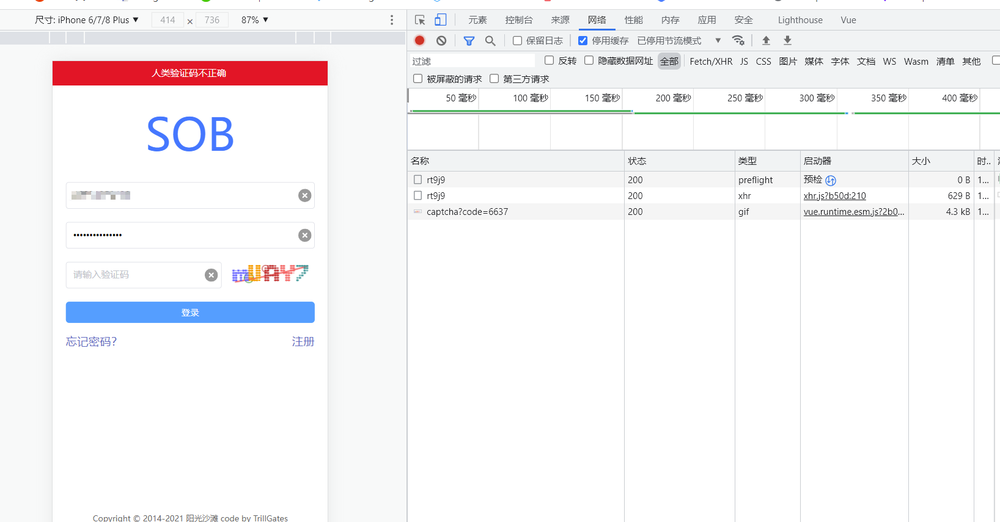
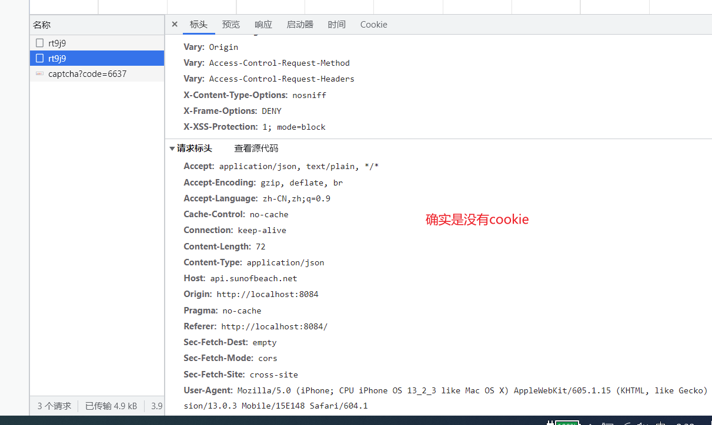
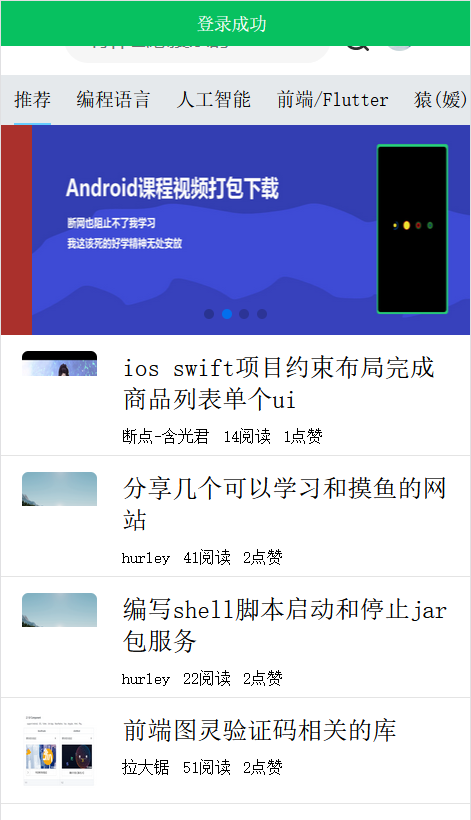

## 前言

这是一篇后来补上的笔记

做验证码功能的时候遇到一个很大的坑，下面给大家细说


## 动态验证码思路

验证码的接口是 `/uc/ut/captcha?code=随机数` 直接访问会发现，它实际就是一张图片，刷新一下，发现图片换了

本质上，我们直接让img的src等于验证码接口地址即可

```html

```

但是，这样就会导致验证码不能刷新。验证码是存在时效性的，还有用户发现验证码看不清，应该能够刷新验证码。如果我们直接写死这个url，那么就只有刷新页面，验证码才会刷新。这时候注意到这个code=随机数。这个code参数是什么都无所谓，甚至这个参数可以换成 abc=xxx都可以。

这个参数的目的就是，让你的链接和之前的不一致。比如之前是  `/uc/ut/captcha?code=22` ，现在变成 `/uc/ut/captcha?code=5845`。浏览器就发现你这个链接不一致了，这时候就会重新请求这个地址，那么就会重新拿到一张图片。

所以我们的关键点，就是要实现，点击图片，让这个链接变的不一致。

这里实现思路非常多，我是这么做的：

把验证码randomCode在data中初始化，给img加上点击事件，每次点击，都给 randomCode 重新赋值，赋值为一个随机数。

每次点击，都重新生成。然后img的src属性，就不再是写死的了，而是把code部分变成一个变量。每次都是拼接的形式

```html

```

这样就实现了每次点击刷新验证码的功能


## 登录功能逻辑分析

登录，本质上就是把用户名，密码，验证码一起发送post请求到服务器，然后服务器返回相关信息。

现在我们通过双向绑定的形式，已经可以从表单中拿到数据，封装到form对象中了

 

接下来，给表单的登录按钮添加点击事件，点击后触发登录方法。

关于登录方法，并不是一上来就发送请求，首先要进行信息的校验。

比如有的用户输入的空，或者随便输入了一串字符，这时候就不发请求，而是对用户进行一个提示。

手机号，我们通过正则表达式来校验。密码，因为不知道具体规则，只校验非空。验证码，因为验证码的种类很多，无法格式校验，只校验非空，校验代码如下：

```js
let {phone, password, captcha} = this.loginFrom
//校验手机号
if (!(/^1[3456789]\d{9}$/.test(phone))) {
    this.$notify.warn('手机号格式错误！');
    return false;
}
//密码不能为空
if (!password) {
    this.$notify.warn('密码不能为空！');
    return false;
}

//验证码不能为空
if (!captcha) {
    this.$notify.warn('验证码不能为空！');
    return false;
}

//校验成功，发送请求
let result = await api.login(phone, password, captcha)
```


还需要注意的是，密码是需要md5加密后发送给服务器的，我们在api的编写那一章节，对这个进行了说明。就是引入md5模块，发送请求之前进行加密。加密得到的结果再发送。这个部分我是放到了api中。

```js
login(phoneNum, password, captcha) {
    //这里需要引入md5加密
    // 安装 npm install blueimp-md5
    // 引入

    let md5Password = md5(password)

    return ajax(`/uc/user/login/${captcha}`, {
        phoneNum,
        password: md5Password
    }, 'POST')
},
```


登录后结果的判断。

登录请求发送之后，会返回一个对象，会有一个success属性，如果是true，表示登录成功。如果是false。表示登录失败。我们就根据这个属性进行判断。

如果登录成功了，进行提示，并存储用户信息。这部分我们放到下一节，使用vuex来制作。

如果登录失败，首先要清空表单，就是直接让data中的属性赋值为"" 。其次，给用户弹出一个提示，提示内容由服务端决定

```js
if (!result.success) {

    //出错了，弹出提示信息
    this.$notify.danger(result.message);

    //更新验证码
    this.randomCode = parseInt(Math.random()*(10000-1+1)+1,10);
    this.loginFrom.captcha = ''
}else {
    this.$notify.success(result.message)

}
```


到这里，登录好像就实现了？

并没有，有一个大坑还没有踩，当你尝试登录，你会发现，不管怎么写，都会提示验证码错误。


## 错误分析


关于验证码，服务端的逻辑是这样的，首先生成一个随机数，然后将这个随机数存储到session中。因为一个用户就是一个session，所以每个用户的验证码都是不同的。再根据这个验证码，生成一张带干扰的图片，防止爬虫或者机器人自动登录。将这个验证码图片返回给浏览器，就是我们看到的验证码。

上面既然用到了session，那么客户端必须携带cookie，因为session是基于cookie实现的。

这里就是一个大坑。我们使用的请求工具类是axios，首先，它默认是不携带cookie的。如果要携带cookie，需要进行配置。

在main.js 配置如下：

```js
import axios from "axios";	//对于js这种，大老远导入一个包只是为了配置一下的做法，不是很能理解
axios.defaults.withCredentials = true; //配置为true	
```


你以为这就完了吗？远远不够。

你配置完等会去访问的时候，还是会报验证码错误。这时候你就会开始怀疑人生。

 

分析下原因：

- 验证码真的输错了

  你试个几十遍，也是不行的

- axios没有携带cookie

  f12一看，发现确实是没有携带

   


问题就变成： 为什么配置了axios，但是还是没有携带cookie？

- 配置出错了

  反复的百度，发现都是这么配置的

- 查询官方文档

  官方文档关于这个配置的说明是：

  ```js
    // `withCredentials` indicates whether or not cross-site Access-Control requests
    // should be made using credentials
    withCredentials: false, // default
  指示是否跨站点访问控制请求，应该使用凭据进行 （机翻）
  ```

  搜索关于cookie的信息，只有一个xsrfCookieName配置项

  ```js
  // `xsrfCookieName` is the name of the cookie to use as a value for xsrf token
    xsrfCookieName: 'XSRF-TOKEN', // default
  ```

  好像并不能解决问题

- 重新配置axios

  单独写了一个axios的配置文件，还是不行

- 陷入自闭


这个问题当时想了很久都没有解决，一直到第二天。。。

我换了一个浏览器打开！



可算是登录成功了。此时使用的是firefox。

后来百度到，chrome不知道为什么，跨域情况不允许携带cookie，导致我的cookie怎么都带不上去


到这里，登录功能就真正做好了