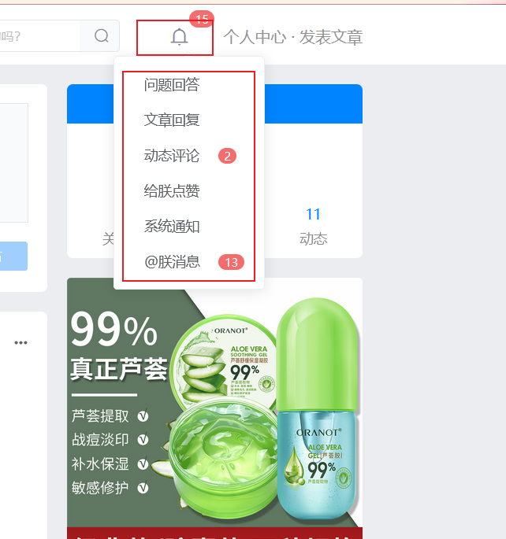
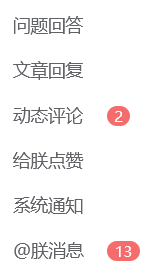
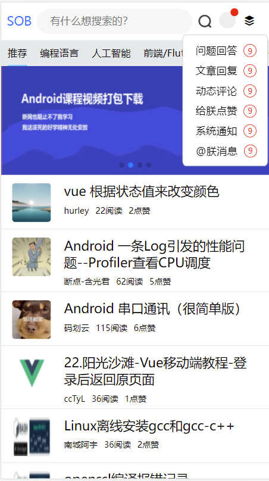

## 前言

下班前再写一篇文章。

之前把登录功能写完了，现在就想要展示用户的消息了。之前一直在考虑怎么实现比较好，最终确定下来，采用sob主站的这种方式：

 

sob主站中，是鼠标滑过，展示一个下拉框，左边是标题，右边是消息数。

我们也采用这种方式来展示用户消息


## 分析

我们要实现的效果先明确，点击用户头像，弹出一个下拉框，在这个框里可以看到用户有哪些未读信息。

那么这个框，它一定是漂浮起来的，不会把内容盒子往下挤开。这个就是脱离文档流的效果，一般用定位，或者浮动实现。

然后，内容主体。因为是一个列表，我们就采用 ul + li 的形式 来展示。

右边的消息条数，可以用一个span盒子存放条数，然后把span盒子的边框和背景颜色调整一下，就得到一个效果。

但是，有组件当然是使用组件，这个消息条数我们使用nutui的 徽标组件(https://nutui.jd.com/2x/#/badge)来实现。


## 实现

### 结构

首先，找到用户头像的地方。我们之前是使用 div盒子装下了用户头像，现在，我们把这个列表页放到这个盒子里：

结构如下：

```html
    <div class="userinfo" v-else @click="toUserInfo">
                    <nut-badge

                            top="5px"
                            right="18px"
                            :isDot="true"
                            class="item"
                    >
                    </nut-badge>
					
                    <ul class="message-box">
                       
						<li></li>

                    </ul>

                </div>
```


大概是这样一个结构。

然后就是徽标的实现，给li外面套一层徽标组件：

top和right属性就是调整徽标的位置

```html
<ul class="message-box">
    <nut-badge
            :value="9"
            top="9px"	
            right="-10px"

    >
        <li class="mitem">问题回答</li>
    </nut-badge>
    
</ul>
```


然后照抄sob主站的那些选项 

最终结构如下：

```html
<ul class="message-box">
    <nut-badge
            :value="9"
            top="9px"
            right="-10px"

    >
        <li class="mitem">问题回答</li>
    </nut-badge>

    <nut-badge
            :value="9"
            top="9px"
            right="-10px"

    >
        <li class="mitem">文章回复</li>
    </nut-badge>

    <nut-badge
            :value="9"
            top="9px"
            right="-10px"

    >
        <li class="mitem">动态评论</li>
    </nut-badge>

    <nut-badge
            :value="9"
            top="9px"
            right="-10px"

    >
        <li class="mitem">给朕点赞</li>
    </nut-badge>

    <nut-badge
            :value="9"
            top="9px"
            right="-10px"

    >
        <li class="mitem">系统通知</li>
    </nut-badge>

    <nut-badge
            :value="9"
            top="9px"
            right="-10px"
    >
        <li class="mitem">@朕消息</li>
    </nut-badge>


</ul>
```


### 样式

首先就是元素的浮动，如果什么也不做，默认会把元素往下顶。现在我们通过设置父盒子为 relative，ul盒子为absolute的方式。给它实现浮动效果。

还要加上 z-index 设置层级，避免被压在下面。

最后就是设置下 内外边距，背景色，字体大小，盒子宽度等。

最终样式如下：

```html
.userinfo {
    position: relative;
}

.message-box {
    border: 1px solid #ccc;
    margin-top: 8px;
    border-radius: 4%;
    padding: 15px 20px 0px 20px;
    z-index: 2;
    position: absolute;
    left: -90%;
    background-color: #fff;
    width: 90px;
}

.message-box .mitem{

    margin-bottom: 15px;
}
```


最终效果：

 
