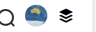

## 前言

上一节，把基本的消息盒子结构都搭建完成了，接下来就需要真正的获取未读消息并展示到页面上。

本节总共需要完成以下功能：

- 展示未读消息数
- 一键已读所有消息功能
- 根据是否有新消息给用户头像上添加小红点


## 消息盒子的展开和关闭

在sob主站，消息盒子是当鼠标滑过就弹出，当失去焦点就隐藏。

但是，移动端没有鼠标，失去焦点这个不太方便写。就用笨办法

思路是： 点击用户头像，展示消息盒子。再次点击用户头像，将消息盒子关闭。

非常简单的逻辑，只需要在data中声明一个标记 `msgBoxShow:false`

然后编写一个点击事件，点击之后将 msgBoxShow 取反

```js
/**
 * 展示或关闭消息盒子
 */
showMsgBox() {
    this.msgBoxShow = !this.msgBoxShow
},
```


然后在消息盒子上加上v-if来决定是否展示

```html
<ul class="message-box" v-if="msgBoxShow">
   
</ul>
```


## 展示未读消息

获取消息数量在接口文档中已经提供这样一个接口 `/ct/msg/count`

携带sob_token访问后，会返回一个对象，对象中包含了 诸如： 文章评论、@朕消息 等消息的数量，我们直接拿着这个对象到页面解析即可。

同样的，在api中编写方法：

```js
/**
 * 获取本人未读消息
 * 凭证存储在cookie当中了
 * @returns {Promise | Promise<unknown>}
 */
getMsgCount() {
    return ajax(`/ct/msg/count`)
},
```


在Header.vue中编写方法调用接口

因为是异步请求，所以需要加上async，后面我就不重复说明了

```js
/**
 * 获取未读消息数量
 */
async getMsgCount() {
    //直接发送请求获取未读消息数量
    let result = await api.getMsgCount();
    this.msgData =  result.data;
},
```

这里我们选择把读取到的消息数量存储到data中，然后在页面中直接取出

```html
<ul class="message-box" v-if="msgBoxShow">
    <nut-badge
            :value="msgData.wendaMsgCount"
            top="9px"
            right="-10px"

    >
        <li class="mitem">问题回答</li>
    </nut-badge>

    <nut-badge
            :value="msgData.articleMsgCount"
            top="9px"
            right="-10px"

    >
        <li class="mitem">文章回复</li>
    </nut-badge>

    <nut-badge
            :value="msgData.momentCommentCount"
            top="9px"
            right="-10px"

    >
        <li class="mitem">动态评论</li>
    </nut-badge>

    <nut-badge
            :value="msgData.thumbUpMsgCount"
            top="9px"
            right="-10px"

    >
        <li class="mitem">给朕点赞</li>
    </nut-badge>

    <nut-badge
            :value="msgData.systemMsgCount"
            top="9px"
            right="-10px"

    >
        <li class="mitem">系统通知</li>
    </nut-badge>

    <nut-badge
            :value="msgData.atMsgCount"
            top="9px"
            right="-10px"
    >
        <li class="mitem"> @ 朕消息</li>
    </nut-badge>


</ul>
```

这样，未读消息就成功展示到页面上了。这里没法截图，因为我的消息测试一键已读功能时全部清除掉了。


## 一键已读

思路：在消息盒子加上一个一键已读的按钮，点击之后将所有未读消息标记为已读。

关于怎么标记，接口文档中已经提供了一键已读的接口： `/ct/msg/read`

同样，在api中创建方法：

```js
/**
 * 将消息全部已读
 */
readAllMsg(){
    return ajax(`/ct/msg/read`)
}
```


在Header.vue中创建点击事件对应的回调。

首先发送请求，判断是否成功，成功之后，清空消息盒子中的数据，然后关闭消息盒子，并给出提示

```js
        	/**
             * 将消息全部已读
             */
            async readAll() {
                let result = await api.readAllMsg()

                if (result.success === true) {
                    this.$notify.success('已读成功！');
                    this.msgBoxShow = false//关闭消息盒子
                    //既然全部已读，那么这个消息盒子中的数据必定是0
                    this.msgData = {
                        articleMsgCount: 0,
                        atMsgCount: 0,
                        momentCommentCount: 0,
                        shareMsgCount: 0,
                        systemMsgCount: 0,
                        thumbUpMsgCount: 0,
                        wendaMsgCount: 0
                    }
                }
            },
```


然后到页面中添加一个按钮，因为消息盒子中每一项都是li，所以直接添加一个li。

给li加上点击事件，为啥是  @click.stop ，因为不希望这个点击事件冒泡。如果冒泡，就会被顶层的div捕获，就会响应showMsgBox事件

我不希望它点击之后立即关闭，所以禁止冒泡。

然后里面还加上了一个扫把图标，这个大家自行到 iconfont 添加到自己项目中

```html
<li class="mitem" @click.stop="readAll">全部已读 <i class="iconfont icon-qingchu"></i></li>
```

效果：

 


## 用户头像小红点的展示

如果有新消息时，用户头像是这样的：

 

没有消息时，小红点应该隐藏

 


要实现这个，需要知道小红点是怎么来的。之前的文章好像没有细说（忘了有没有说）。

这个红点还是nutui的徽标组件 nut-badge。

头像部分代码如下：

```html
<nut-badge

        top="5px"
        right="18px"
        :isDot="标记"
        class="item"
>
    <nut-avatar

            class="user-avatar"

            bg-icon
            :bg-image="userInfo.avatar"
    ></nut-avatar>

</nut-badge>
```

isDot 就决定了是否展示小红点，如果是true，就展示，false则隐藏。


那么现在的问题就是，怎么知道有没有未读消息？

之前的 `/ct/msg/count` 接口中，返回了所有未读消息的数量，只要所有未读消息数量都是0，说明没有未读消息。

思路有了，具体怎么实现呢？

因为这个 是否展示红点  的结果，是根据msgData 里面的消息数计算得到的，所以非常适合写一个计算属性。

在computed中编写如下：

首先是，遍历msgData中所有属性名，然后根据属性名到msgData对象中取值。只要有一个属性（消息）的数量 大于0，就直接返回true，也就是有未读消息，如果遍历完毕了，还没有返回。说明所有消息都是0,返回false表示没有已读消息了

```js
/**
 *计算是否有新消息
 */
hasNewMessage() {
	
    for (let key in this.msgData) {
        if (this.msgData[key] > 0) {
            return true
        }
    }
    return false
},
```


然后直接将这个计算属性放到 nut-badge中

```html
<nut-badge

        top="5px"
        right="18px"
        :isDot="hasNewMessage"
        class="item"
>
```

就完成了
