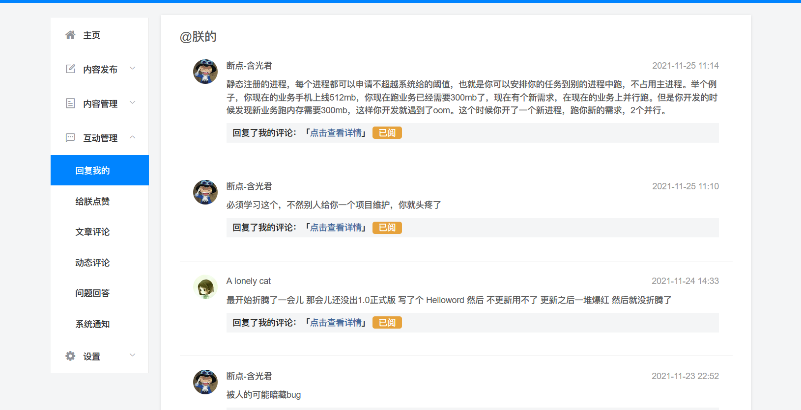

## 部分优化

开头先做一点小优化。

之前写文章列表的时候，左侧的标题图片被缩放了，特别的丑。

为了解决这个问题，我们给之前的img标签加上一个css属性，

找到Home.vue，找到文章列表部分，再找到每个文章item，左侧的img标签：

```html
//简单的加上了一个 style属性，值是 object-fit: cover; 这个属性有一定的兼容性问题，但是没关系，我们设计时暂时不考虑兼容性

```


## 前言

本节完成消息列表结构搭建，下一节实现数据的获取。

首先，看看csdn是怎么写的：

 

 

再看下sob主站怎么写的：




 


再看下数据是什么格式的

文章评论列表：

```json
{
  "success": true,
  "code": 10000,
  "message": "获取评论成功",
  "data": {
    "content": [
      {
        "_id": "910465668980146176",
        "bUid": "1314408005793603584",
        "articleId": "1460552483079217153",
        "nickname": "拉大锯",
        "avatar": "https://imgs.sunofbeaches.com/group1/M00/00/07/rBsADV22ZymAV8BwAABVL9XtNSU926.png",
        "uid": "1153952789488054272",
        "hasRead": "1",
        "title": "24.阳光沙滩-移动端Vue教程-用户消息盒子结构",
        "content": "你的21号文章我还没弄，电脑坏了，等寄回来我再恢复。",
        "createTime": "2021-11-17 09:45",
        "timeText": null
      }
     ]
   }
}
```


动态的评论：

```json
{
  "success": true,
  "code": 10000,
  "message": "获取成功.",
  "data": {
    "content": [
      {
        "_id": "1463513487924813826",
        "bUid": "1314408005793603584",
        "momentId": "1463441644408823810",
        "nickname": "断点-含光君",
        "avatar": "https://imgs.sunofbeaches.com/group1/M00/00/04/rBsADV2YuTKABc4DAABfJHgYqP8031.png",
        "uid": "1139423796017500160",
        "hasRead": "1",
        "title": "<div>接触了jetpack，又看了下 a lonely cat 的 SunnyBeach项目，发现确实android开发比网...",
        "content": "你是不是忘记加[doge]了？",
        "createTime": "2021-11-24 22:23",
        "timeText": null
      },
      
      ]
   }
}
```


发现数据格式也是差不多的。

### 结论：

既然数据差不多，页面也差不多，那么就意味着，这几个标签页，是可以复用同一个页面的。


## 页面结构搭建

我们决定采用侧边栏的方式展示这几个选项列表。

目标效果如下：

 


分析一下：

最左侧是一个可以切换的tab栏，点击不同的tab就可以查看不同分类的消息，这个tab是通过 nutui里面的 `Tab 选项卡` 实现的，https://nutui.jd.com/2x/#/tab


右侧就是消息列表。整个列表用ul包裹，每个ul里面是一个li。一个li就是一条消息。

每个li底部有一条分割线，通过下边框来实现的。同时为了使结构清晰，每个li上下都有间距。


到消息详情。

 

最外层是上下结构，

- 下方标签

  水平布局，在一条横线上直接摆放三个盒子。第一个盒子是这个回复的分类，第二个盒子标记是否已读，第三个盒子标记回复的时间

- 消息主体

  左侧是一个img图片

  右侧又是分为上下结构，第一个是用户名，第二个是回复内容，最下面是相关的评论或者博客


## 代码实现

```html
<template>

    <nut-tab @tab-switch="tabSwitch" :is-scroll="true" position-nav="left" :wrapper-height="tabHeight" :def-index="0">
        <nut-tab-panel tab-title="@朕">

            <ul>
                <li class="mli">

                    <div class="mItem">
                        <div class="mleft">

                            

                        </div>

                        <div class="mRight">
                            <div class="nickname">拉大锯</div>
                            <div class="content">你的21号文章我还没弄，电脑坏了，等寄回来我再恢复。</div>
                            <div class="title">24.阳光沙滩-移动端Vue教程-用户消息盒子结构

                            </div>


                        </div>
                    </div>


                    <div class="mBottom">
                        <div class="mType">@我</div>
                        <span class="readStatus read">已阅</span>
                        <div class="mTime">2021-11-17 09:45</div>
                    </div>
                </li>

                <li class="mli">

                    <div class="mItem">
                        <div class="mleft">

                            

                        </div>

                        <div class="mRight">
                            <div class="nickname">拉大锯</div>
                            <div class="content">你的21号文章我还没弄，电脑坏了，等寄回来我再恢复。</div>
                            <div class="title">24.阳光沙滩-移动端Vue教程-用户消息盒子结构

                            </div>


                        </div>
                    </div>


                    <div class="mBottom">
                        <div class="mType">@我</div>
                        <span class="readStatus read">已阅</span>
                        <div class="mTime">2021-11-17 09:45</div>
                    </div>
                </li>
            </ul>


        </nut-tab-panel>
        <nut-tab-panel tab-title="点赞">页签2</nut-tab-panel>
        <nut-tab-panel tab-title="文章">页签3</nut-tab-panel>
        <nut-tab-panel tab-title="动态">页签4</nut-tab-panel>
        <nut-tab-panel tab-title="问题">页签5</nut-tab-panel>
        <nut-tab-panel tab-title="通知">页签6</nut-tab-panel>
    </nut-tab>


</template>

<script>
    export default {
        name: "Message",
        data() {
            return {
                currentTab: 1, //当前所在tab
                tabHeight: 600,//tab的高度
            }
        },
        created() {
            this.currentTab = this.$route.query.type
            //设置整个tab的高度
            this.tabHeight = document.body.scrollHeight * 0.89
        }
    }
</script>

<style scoped>
    .tab {
        height: 100%;
    }

    .nut-tab {
        height: 80%;
    }


    .mli{

        margin-top: 30px;
        padding-bottom: 20px;
        border-bottom: 1px solid #ccc ;
    }

    .mItem{
        display: flex;
        font-size: 18px;
    }
    .mleft img{

        width: 40px;
        height: 40px;
        border-radius: 50%;
    }
    .mRight{
        padding-left: 10px;
        display: flex;
        flex-direction: column;

    }
    .mRight .nickname{
        margin-bottom: 10px;
        font-weight: bold;

    }
    .mRight .content{
        font-size: 16px;
    }
    .mRight .title{

        margin-top: 10px;
        font-size: 14px;
        color: #406599;
    }


    .mBottom{

        margin-top: 15px;
        display: flex;
        justify-content: space-between;
        font-size: 15px;
    }
    .mBottom .readStatus{
        padding: 2px 5px 2px 5px;
        color: #fff;
        font-size: 12px;
        border-radius: 10%;
        background-color: #f56c6c;

        height: 20px;
        text-align: center;
        line-height: 20px;
    }
    .mBottom .read{
        background-color: #e6a23c;
    }

    .mType{

        width: 46px;
        height: 22px;
        text-align: center;
        line-height: 22px;
        border: 1px solid #ccc;
        font-size: 13px;
        color: #636363;
        border-radius: 10%;
    }
    .mTime{
        height: 22px;
        line-height: 22px;
        align-self: end;
    }


</style>
```


