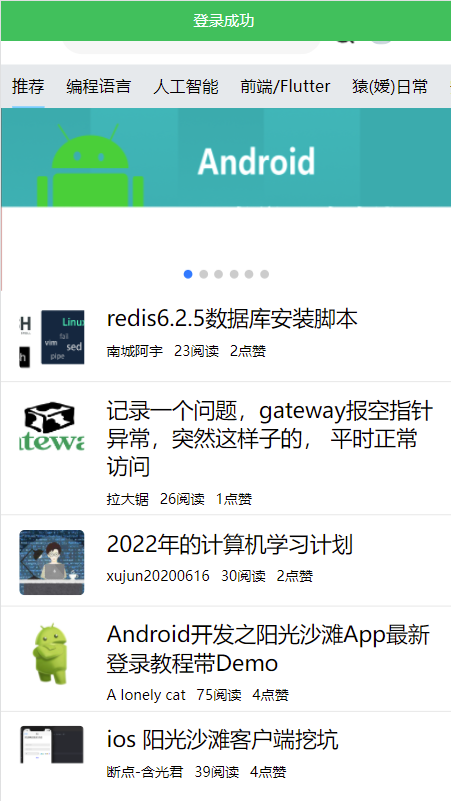

## 0.前言-迟到的更新

很久没有动过这个vue了，工作忙了一些。

前段时间，sob登录不上了，是因为cookie无法携带过去，因此康师傅进行了接口的更新。

详情看：https://www.sunofbeach.net/a/1476738866298781698

我给大家直接总结下作了哪些变化：

- api域名发生了变化

  以前是`https://api.sunofbeach.com`,现在换成了`https://api.sunofbeaches.com`

  所以这个baseurl是必须更换

- 登录时验证码的验证方式

  以前是将一个值放在cookie中，类似于sessionid的东西，这个sessionid对应着发送给你的验证码，现在cookie传递不了。于是这个值放在了header中。key为 `l_c_i`，访问登录接口时需要在header上加上他

- token的携带方式

  以前token我们是不进行存储的，为啥，因为他也是放在cookie中，而浏览器访问时会默认携带cookie，所以不需要存储。

  现在cookie传递不了，需要将token放在请求头中，key为 `sob_token`

- 验证码图片的展示方式

  以前我们是直接用 `src = api地址` 这种方式来获得验证码。浏览器解析标签时，会自动发起一个get请求，得到图片。

  现在我们需要拿到，和验证码一起返回的响应头，那就不能让浏览器来发起请求，需要我们手动发起请求，并且自己从响应头中取出 `l_c_i`这个东西，然后把这个图片展示到标签中。

  这部分康师傅给出了具体的代码。


## 1.修改

从上面的分析，可以得知，我们需要改动以下部分的代码：

- api域名

  这个很简单，我们之前把域名放到了 src/api/ajax.js 里面

  直接把变量内容改变

  ```js
  let BASE_URL='https://api.sunofbeaches.com' //阳光沙滩api接口地址
  ```

- 配置axios的请求拦截和响应拦截

  请求拦截，就是说每次发请求之前，我要给你加点东西，这里我们要加的就是请求头

  响应拦截，就是每次得到响应的时候，我要提前从响应中取出点什么，这里我们就是要从响应头中取出sob_token。

  我们到main.js中进行修改

  下面看代码：

  ```js
  import axios from "axios";
  
  axios.defaults.withCredentials = true; //配置为true
  //配置axios的拦截器
  //请求拦截器
  axios.interceptors.request.use(function (request) {
      //发送请求之前，把 token 和 lci 带上，放在请求头中
      let captchaKey = localStorage.getItem("l_c_i")
      let sobToken = localStorage.getItem("sob_token")
  
      //添加请求头
      request.headers.l_c_i = captchaKey;
      request.headers.sob_token = sobToken;
  
      return request;
  });
  
  
  //响应拦截器
  axios.interceptors.response.use(
      response => {
          //拦截响应，做统一处理
          //只要响应中有 lci 和sob_token，就存入本地
          if ( response.headers.sob_token) {
  
              //这里只存储了sobtoken，为啥，因为lci 那个请求是通过fetch发起的，和axios没有关系
              localStorage.setItem("sob_token", response.headers.sob_token)
  
          }
          return response
      }
  )
  ```

  关于存储部分，我直接将两个变量值存储到了localstorage中。

  这样，token的存储和携带，以及l_c_i的携带问题就解决了

  

- 验证码的展示

  因为不能直接用url来展示验证码了，需要修改。主要参考康师傅的文章来写的。

  改动如下：

  - img标签不再使用src属性，并且添加一个id，点击事件换成验证码加载的方法

    ```html
    
    ```

  - 创建一个loadCaptcha方法用于加载验证码

    ```js
      /**
                 * 加载验证码
                 */
                loadCaptcha() {
                    //每次刷新验证码，就是把code变化，然后发起请求
                    this.randomCode = parseInt(Math.random() * (10000 - 1 + 1) + 1, 10);
    				
                    //这里使用原生的fetch来发起请求
                    fetch(this.captchaUrl + this.randomCode).then((response) => {
                        //获取到key
                        let l_c_i = response.headers.get("l_c_i");
                        //存储到localstorage中，用于axios发起请求时拦截器的添加header
                        localStorage.setItem("l_c_i", l_c_i);
    					//这里首先拿到响应的 blob数据，其实就是图片数据，然后设置到img标签中
                        //这里是通过id来找到验证码的dom元素
                        response.blob().then(function (myBlob) {
                            const urlCreator = window.URL || window.webkitURL;
                            document.getElementById("captcha").src = urlCreator.createObjectURL(myBlob);
                        });
                    });
                }
    ```

  - 在mounted中调用loadCaptcha方法


## 2.最终效果




