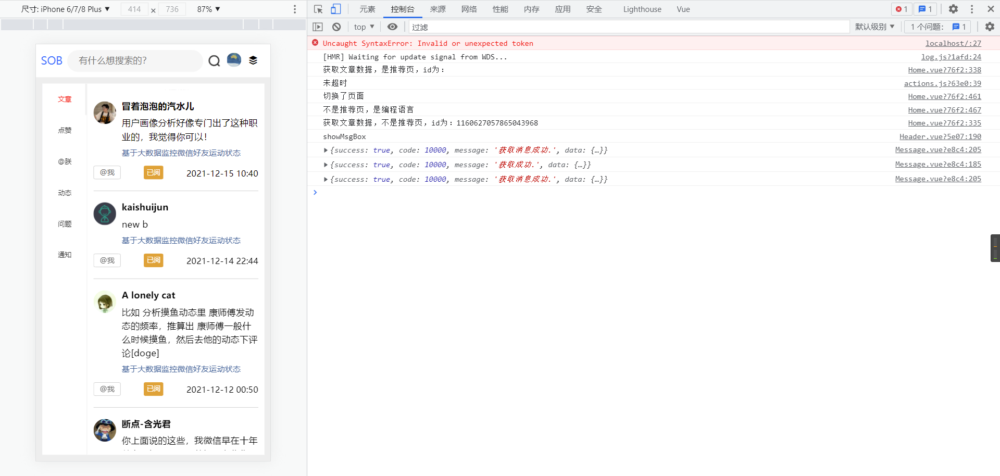

## 0.前言

在25篇的时候，已经将消息详情的结构搭起来了。这部分就将数据给展示出来。

当前页面总共要展示6个接口的数据，我将每个接口的数据对比了一些，发现存在一些共性，如下所示：

```js
文章评论：
{
  "success": true,
  "code": 10000,
  "message": "获取评论成功",
  "data": {
    "content": [
      {
        "_id": "920626252711198720",
        "bUid": "1314408005793603584",
        "articleId": "1469638310052782082",
        "nickname": "冒着泡泡的汽水儿",
        "avatar": "https://images.sunofbeaches.com/content/2021_05_18/844171416617091072.png",
        "uid": "1255088796991492096",
        "hasRead": "1",
        "title": "基于大数据监控微信好友运动状态",
        "content": "用户画像分析好像专门出了这种职业的，我觉得你可以！",
        "createTime": "2021-12-15 10:40",
        "timeText": null
      }
      
    ],
    "pageable": {
      "sort": {
        "unsorted": true,
        "sorted": false
      },
      "pageSize": 30,
      "pageNumber": 0,
      "offset": 0,
      "unpaged": false,
      "paged": true
    },
    "totalPages": 2,
    "last": false,
    "totalElements": 34,
    "first": true,
    "sort": {
      "unsorted": true,
      "sorted": false
    },
    "numberOfElements": 30,
    "size": 30,
    "number": 0
  }
}

@我
{
  "success": true,
  "code": 10000,
  "message": "获取消息列表成功.",
  "data": {
    "content": [
      {
        "_id": "1478977947539898369",
        "beUid": "1314408005793603584",
        "beNickname": null,
        "uid": "1139423796017500160",
        "nickname": "断点-含光君",
        "url": "/m/1478915274399842305#1478977947539898369",
        "content": "这么丑你也啃了？",
        "type": "moment",
        "hasRead": "0",
        "publishTime": "2022-01-06 14:33",
        "timeText": null,
        "avatar": "https://imgs.sunofbeaches.com/group1/M00/00/04/rBsADV2YuTKABc4DAABfJHgYqP8031.png",
        "exId": "1478915274399842305"
      }
    ],
    "pageable": {
      "sort": {
        "unsorted": false,
        "sorted": true
      },
      "pageSize": 10,
      "pageNumber": 0,
      "offset": 0,
      "unpaged": false,
      "paged": true
    },
    "totalPages": 16,
    "last": false,
    "totalElements": 157,
    "first": true,
    "sort": {
      "unsorted": false,
      "sorted": true
    },
    "numberOfElements": 10,
    "size": 10,
    "number": 0
  }
}


动态评论
{
  "success": true,
  "code": 10000,
  "message": "获取成功.",
  "data": {
    "content": [
      {
        "_id": "1478927991999332353",
        "bUid": "1314408005793603584",
        "momentId": "1478643852838469634",
        "nickname": "南城阿宇",
        "avatar": "https://imgs.sunofbeaches.com/group1/M00/00/2A/rBsADV80qt6ASPajAABRTM8wiqs313.png",
        "uid": "1274165387499433984",
        "hasRead": "1",
        "title": "刚刚真的手滑执行了一下rm -rf，刚刚敲完回车，我说怎么不对劲，赶紧ctrl c 停下来，执行了ls，报没有命令，心里顿时凉凉...",
        "content": "Linux 教父",
        "createTime": "2022-01-06 11:14",
        "timeText": null
      }
    ],
    "pageable": {
      "sort": {
        "unsorted": false,
        "sorted": true
      },
      "pageSize": 30,
      "pageNumber": 0,
      "offset": 0,
      "unpaged": false,
      "paged": true
    },
    "totalPages": 3,
    "last": false,
    "totalElements": 81,
    "first": true,
    "sort": {
      "unsorted": false,
      "sorted": true
    },
    "numberOfElements": 30,
    "size": 30,
    "number": 0
  }
}

```


因为大体数据结构都一致，只有content 里面的item属性不一致。

那么就决定了，我们后续页面结构是单独设置的，但是数据格式是可以通用的。

## 1.通用格式的定义

基于上面的说明，我定义了这样的一个格式：

```js
data() {
    return {
        currentTab: 0, //当前所在tab
        tabHeight: 600,//tab的高度
        msgList: [],// 数据列表，通用
        isUnMore: false,//对于滑动组件，是否没有更多数据
        isLoading: false,//是否正在下拉刷新数据
        currentPage: 1,//当前所在页码数
        totalPages: 1,//评论的总页数，用于判断是否还有下一页
    }
},
```


msgList统一存放消息列表，但是这个数组里面的对象属性是不一致的。

统一通过currentTab这个变量来判断当前是什么tab，不同的tab访问不同的api接口

因此，方法设计如下：

```js
 created() {
     		//用户从右上角点击消息类型后就会跳转到这里，取出用户想进入的tab的索引
            this.currentTab = this.$route.query.type * 1
            //设置整个tab的高度
            this.tabHeight = document.body.scrollHeight * 0.89
        },
        mounted() {
            //根据当前所在tab的索引，刷新数据
            this.tabSwitch(this.currentTab)


        },
        methods: {

            /**
             * 获取消息列表，具体调用什么api取决于当前所在tab
             * @param page 当前页码数
             * @param isMerge 是否将新数据和并到旧数据中
             *
             */
            async getMsgData(page = 1, isMerge = false) {


                //不同的tab访问的api是不一样的，所以在这里先判断一下是哪个tab，再做额外处理
                switch (this.currentTab) {
                    //这里加大括号是为了限制变量的作用域，否则第二个case会受到第一个case的变量名的影响
                    case 0: {
                        //文章评论
                        let result = await api.getArticleMessage(page)

                        //取出评论列表
                        let msgList = result.data.content

                        //取出总页数
                        this.totalPages = result.data.totalPages

                        if (isMerge) {
                            //合并之前和现在的数据
                            //合并之前，涉及到一个去重问题
                            let obj = {}
                            for (let i = 0; i < this.msgList.length; i++) {
                                obj[this.msgList[i]._id] = this.msgList[i]
                            }
                            for (let i = 0; i < msgList.length; i++) {
                                //如果拿着你的id去 obj 里找，找不到，说明原本的 this.msgList没有这个对象

                                if (!obj[msgList[i].id]) {
                                    this.msgList.push(msgList[i])
                                } else {
                                    // console.log('不会被添加')
                                }
                            }
                        } else {
                            //更新数据
                            this.msgList = msgList
                        }

                        break;
                    }
                    case 1:{
                        //点赞数据

                        let result = await api.getThumbMessage(page)
                        console.log(result)
                        break
                    }
                    case 2:{
                        //@我的
                        let result = await api.getAtMessage(page)
                        console.log(result)
                        break
                    }

                    case 3:{
                        //动态评论
                        let result = await api.getMomentMessage(page)
                        console.log(result)
                        break
                    }

                    case 4:{
                        //问题
                        let result = await api.getWendaMessage(page)
                        console.log(result)
                        break
                    }

                    case 5:{
                        //通知

                        let result = await api.getSystemMessage(page)
                        console.log(result)
                        break
                    }


                }


            },


            /**
             * 下拉刷新
             */
            pulldown() {

                this.isLoading = true

                //根据当前所在tab刷新数据
                switch (this.currentTab) {
                    case 0:
                        //刷新@我板块
                        this.getMsgData()
                        break;
                }
                clearTimeout(this.timer)

                this.timer = setTimeout(() => {
                    this.isLoading = false
                }, 300)
            },


            /**
             * 上拉加载更多
             */
            loadMoreVert() {
                //判断是否还有下一页
                if (this.currentPage >= this.totalPages) {
                    //如果当前页码已经大于 或者等于最大页码数，那就不加载下一页
                    // console.log("到底了")
                    this.isUnMore = true
                    return
                }

                this.isUnMore = true


                //根据当前所在tab刷新数据
                switch (this.currentTab) {
                    case 0:
                        //刷新@我板块下一页
                        this.getMsgData(++this.currentPage, true)
                        break;
                }

                clearTimeout(this.timer)
                this.timer = setTimeout(() => {
                    this.isUnMore = false
                }, 300)

            },

            /**
             * 切换了tab
             */
            tabSwitch(val) {
                //更新tab索引
                this.currentTab = val;

                //切换后刷新数据
                this.getMsgData()

            },


        }
```

上述展示的都是通用的方法。loadMoreVert 以及 pulldown等是因为消息列表等li外面嵌套了一层nut-scroller（直接看后面的代码），这个也是每个tab都需要的，所以设置为通用。


## 2.文章评论部分的代码

上面说到，数据格式通用，但是不同的tab，展示的数据不一样，有些属性在这个tab有，另一个tab就没有。所以页面结构是需要每个tab单独定义（部分复用，剩下的需要单独配置）。下面展示的是完整的文章评论的代码

```html
<template>

    <nut-tab :is-scroll="true" position-nav="left" :wrapper-height="tabHeight" :def-index="currentTab"
             @tab-switch="tabSwitch"
    >
        <nut-tab-panel tab-title="文章">

            <nut-scroller
                    :type="'vertical'"
                    :is-un-more="isUnMore"
                    :is-loading="isLoading"
                    @pulldown="pulldown"
                    unloadMoreTxt="到底了"
                    @loadMore="loadMoreVert"
                    :init-data="msgList"

            >


                <div slot="list">
                    <li class="mli" v-for="article in msgList" :key="article._id">

                        <div class="mItem">
                            <div class="mleft">

                                

                            </div>

                            <div class="mRight">
                                <div class="nickname">{{article.nickname}}</div>
                                <div class="content">{{article.content}}</div>
                                <div class="title">{{article.title}}</div>


                            </div>
                        </div>


                        <div class="mBottom">
                            <div class="mType">@我</div>
                            <span class="readStatus" :class="article.hasRead==1?'read':''">{{article.hasRead==1?'已阅':'未读'}}</span>
                            <div class="mTime">{{article.createTime}}</div>
                        </div>
                    </li>

                </div>
            </nut-scroller>


        </nut-tab-panel>

          
        <nut-tab-panel tab-title="@朕">页签3</nut-tab-panel>
        <nut-tab-panel tab-title="动态">页签4</nut-tab-panel>
        <nut-tab-panel tab-title="问题">页签5</nut-tab-panel>
        <nut-tab-panel tab-title="通知">页签6</nut-tab-panel>
    </nut-tab>


</template>

<script>
    import api from '../../api/index'

    export default {
        name: "Message",
        data() {
            return {
                currentTab: 0, //当前所在tab
                tabHeight: 600,//tab的高度
                msgList: [],// 数据列表，通用
                isUnMore: false,//对于滑动组件，是否没有更多数据
                isLoading: false,//是否正在下拉刷新数据
                currentPage: 1,//当前所在页码数
                totalPages: 1,//评论的总页数，用于判断是否还有下一页
            }
        },
        created() {
            this.currentTab = this.$route.query.type * 1
            //设置整个tab的高度
            this.tabHeight = document.body.scrollHeight * 0.89
        },
        mounted() {
            //根据当前所在tab的索引，刷新数据
            this.tabSwitch(this.currentTab)


        },
        methods: {

            /**
             * 获取消息列表，具体调用什么api取决于当前所在tab
             * @param page 当前页码数
             * @param isMerge 是否将新数据和并到旧数据中
             *
             */
            async getMsgData(page = 1, isMerge = false) {


                //不同的tab访问的api是不一样的，所以在这里先判断一下是哪个tab，再做额外处理
                switch (this.currentTab) {
                    //这里加大括号是为了限制变量的作用域，否则第二个case会受到第一个case的变量名的影响
                    case 0: {
                        //文章评论
                        let result = await api.getArticleMessage(page)

                        //取出评论列表
                        let msgList = result.data.content

                        //取出总页数
                        this.totalPages = result.data.totalPages

                        if (isMerge) {
                            //合并之前和现在的数据
                            //合并之前，涉及到一个去重问题
                            let obj = {}
                            for (let i = 0; i < this.msgList.length; i++) {
                                obj[this.msgList[i]._id] = this.msgList[i]
                            }
                            for (let i = 0; i < msgList.length; i++) {
                                //如果拿着你的id去 obj 里找，找不到，说明原本的 this.msgList没有这个对象

                                if (!obj[msgList[i].id]) {
                                    this.msgList.push(msgList[i])
                                } else {
                                    // console.log('不会被添加')
                                }
                            }
                        } else {
                            //更新数据
                            this.msgList = msgList
                        }

                        break;
                    }
                    case 1:{
                        //点赞数据

                        let result = await api.getThumbMessage(page)
                        console.log(result)
                        break
                    }
                    case 2:{
                        //@我的
                        let result = await api.getAtMessage(page)
                        console.log(result)
                        break
                    }

                    case 3:{
                        //动态评论
                        let result = await api.getMomentMessage(page)
                        console.log(result)
                        break
                    }

                    case 4:{
                        //问题
                        let result = await api.getWendaMessage(page)
                        console.log(result)
                        break
                    }

                    case 5:{
                        //通知

                        let result = await api.getSystemMessage(page)
                        console.log(result)
                        break
                    }


                }


            },


            /**
             * 下拉刷新
             */
            pulldown() {

                this.isLoading = true

                //根据当前所在tab刷新数据
                switch (this.currentTab) {
                    case 0:
                        //刷新@我板块
                        this.getMsgData()
                        break;
                }
                clearTimeout(this.timer)

                this.timer = setTimeout(() => {
                    this.isLoading = false
                }, 300)
            },


            /**
             * 上拉加载更多
             */
            loadMoreVert() {
                //判断是否还有下一页
                if (this.currentPage >= this.totalPages) {
                    //如果当前页码已经大于 或者等于最大页码数，那就不加载下一页
                    // console.log("到底了")
                    this.isUnMore = true
                    return
                }

                this.isUnMore = true


                //根据当前所在tab刷新数据
                switch (this.currentTab) {
                    case 0:
                        //刷新@我板块下一页
                        this.getMsgData(++this.currentPage, true)
                        break;
                }

                clearTimeout(this.timer)
                this.timer = setTimeout(() => {
                    this.isUnMore = false
                }, 300)

            },

            /**
             * 切换了tab
             */
            tabSwitch(val) {
                //更新tab索引
                this.currentTab = val;

                //切换后刷新数据
                this.getMsgData()

            },


        }
    }
</script>

<style scoped>
    .tab {
        height: 100%;
    }

    .nut-tab {
        height: 80%;
    }


    .mli {

        margin-top: 20px;
        padding-bottom: 20px;
        border-bottom: 1px solid #ccc;
    }

    .mItem {
        display: flex;
        font-size: 18px;
    }

    .mleft img {

        width: 40px;
        height: 40px;
        border-radius: 50%;
    }

    .mRight {
        padding-left: 10px;
        display: flex;
        flex-direction: column;

    }

    .mRight .nickname {
        margin-bottom: 10px;
        font-weight: bold;
        font-size: 16px;

    }

    .mRight .content {
        font-size: 16px;
        line-height: 1.5;
    }

    .mRight .title {

        margin-top: 10px;
        font-size: 14px;
        color: #406599;
    }


    .mBottom {

        margin-top: 16px;
        display: flex;
        justify-content: space-between;
        font-size: 15px;
    }

    .mBottom .readStatus {
        padding: 2px 5px 2px 5px;
        color: #fff;
        font-size: 12px;
        border-radius: 10%;
        background-color: #f56c6c;

        height: 20px;
        text-align: center;
        line-height: 20px;
    }

    .mBottom .read {
        background-color: #e6a23c;
    }

    .mType {

        width: 46px;
        height: 22px;
        text-align: center;
        line-height: 22px;
        border: 1px solid #ccc;
        font-size: 13px;
        color: #636363;
        border-radius: 10%;
    }

    .mTime {
        height: 22px;
        line-height: 22px;
        align-self: end;
    }


    .nut-scroller {
        height: calc(100vh - 100px);


    }
</style>
```


## 3.效果图

