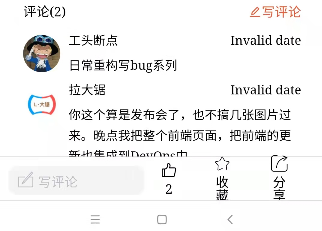
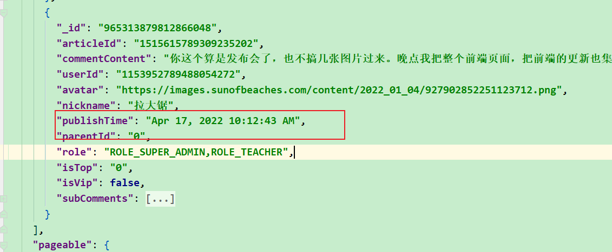
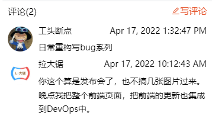
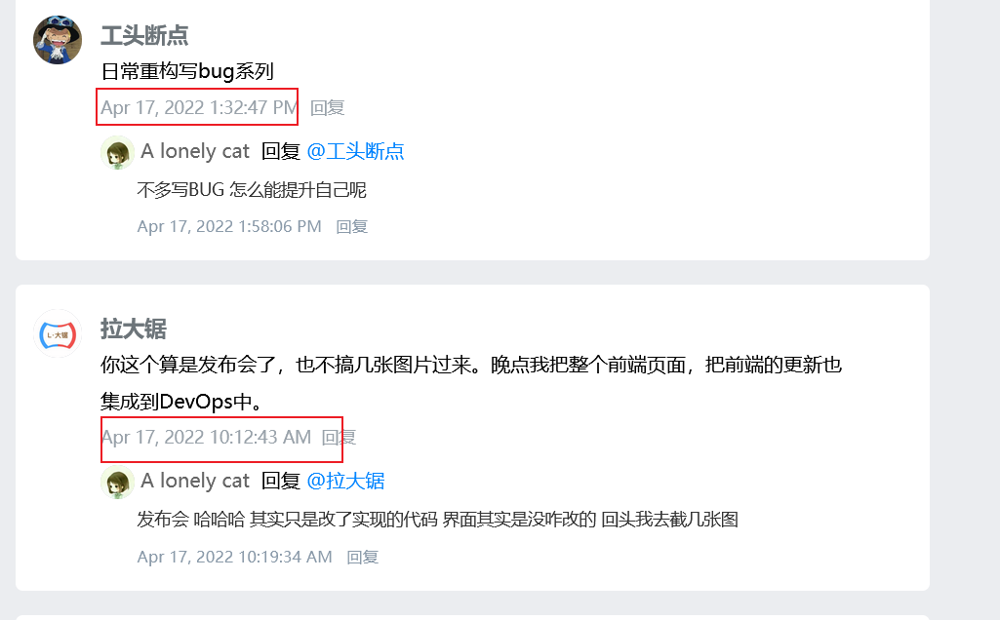
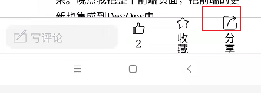
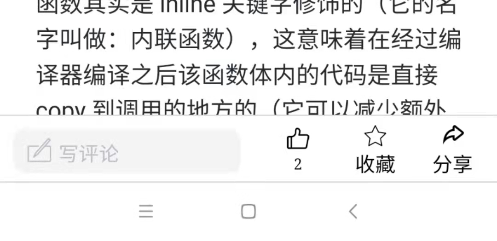
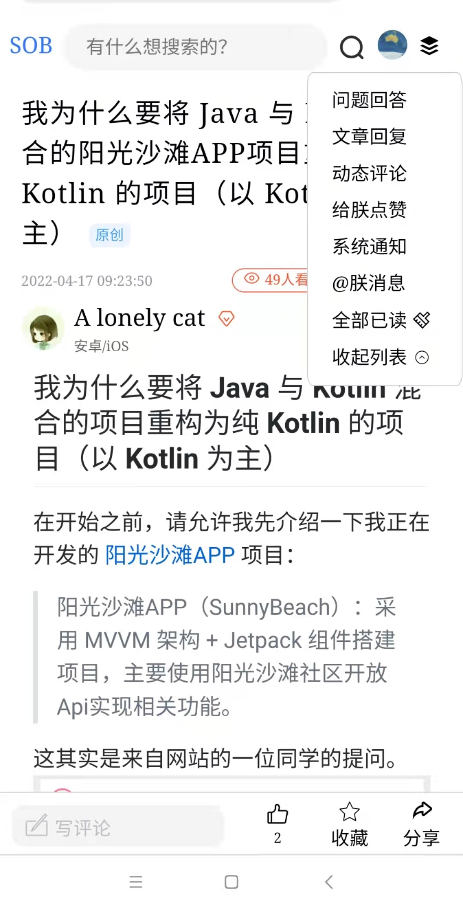

## 一、修复部分bug

- #### 文章评论的时间格式化的问题

 

为什么会出现这个问题，我们的处理逻辑是：调用接口，取出接口中的publishTime属性，然后计算出评论时间与现在时间的间隔（几天前，几分钟前）。

但是目前，接口返回的publishTime有时的格式是

 

没法格式化，所以我们对ArticleDetail.vue中的calcTime方法进行修改如下：

```javascript
 /**
             * 计算距离现在有多长时间
             */
            calcTime(timeStr) {
                let formatResult = moment(timeStr, "YYYY-MM-DD HH:mm").fromNow()
                //只要转换失败，就返回原字符串
                if (formatResult=='Invalid date'){
                    return timeStr
                }else {
                    return formatResult
                }
            }
```

治标不治本，只能简单的修复下。修复后：

 

会觉得很怪。其实pc端就是这么展示的：

 

- 评论按钮溢出的问题

  我在真机上演示时发现，评论栏的点赞按钮，收藏按钮都是有点突出：

   

  下面来解决这个问题。

  出现这个问题，就是文字被竖直摆放了，就是宽度不足导致的。

  所以我们给这个文字单独加上一个宽度（完整的html结构和样式我会在文末给出，不用担心找不到这个结构）：

  ```javascript
   <span class="desc">{{articleInfo.thumbUp}}</span>   
   .footerTool .btn .desc {
          width: 32px;
   }
  ```

  另外，我们调整下布局，之前就是生搬硬套，把几个按钮摆放了下，现在改下，用div装起来，放在右边，然后flex布局摆放

  ```html
  
  <div class="right">
  
      <span class="dianzan btn">
          <i class="iconfont tubiao  icon-dianzan"></i>
          <span class="desc">{{articleInfo.thumbUp}}</span>
      </span>
      <span class="collect btn">
          <i class="iconfont tubiao icon-shoucang"></i>
          <span  class="desc">收藏</span>
      </span>
  
      <span class="share btn">
          <i class="iconfont tubiao icon-fenxiang"></i>
          <span  class="desc">分享</span>
      </span>
  </div>
              
              
  .right{
  
      display: flex;
      flex: 1;
      justify-content: space-around;
  }
  ```

  这里要注意，right的父亲是footerTool，它也用了flex布局，如果不处理，那么right的宽度会被限制，所以我们加上了`flex: 1;`，让右侧的盒子right占满剩余宽度。

  最后，这个图标选的确实不太合适，分享图标太大了，我们换一个。

  操作也简单，就是去iconfont找图标，添加到项目，然后重新生成font链接，修改到index.html。然后用新的class替换掉原有的class即可。

  最终修复如下：

 


- 右上角消息列表无法收起的问题

  其实这个消息列表在pc端比较常见，因为pc端有鼠标悬浮事件。但是对于手机端，就没有这个事件了，人也不可能一直按着手指去滑动。所以原本设计的鼠标移开就消失的想法不可行。后来我尝试了很多，最后设置成点击右上角弹出，再点击右上角消失这种形式。

  但是不太好用，这次我决定加一个收起按钮。

  实现也简单，找到Header.vue，在下拉列表末尾加上一个li，这个li点击之后就会设置`msgBoxShow=false`从而隐藏下拉列表。】

  ```html
  <li class="mitem" @click.stop="msgBoxShow=false">收起列表 <i class="iconfont icon-anniu_jiantoushouqi_o"></i></li>
  
  ```

  修复后效果如下：

   

- 首页-> 回到顶部后滑动，又回到原本底部的位置

  原本是点击回到顶部后页面返回了页头，但是当你尝试向下滑动，发现又回到了之前底部的位置。这个是因为，我们手动让页面滚动到顶部，但是nutui组件记忆了之前的位置。你回到顶部后，记忆的位置没有发生变化。所以回到顶部后，我们需要手动触发nutui自身的滚动事件。

  触发这个事件只需把`:scrollTo="scrollY"` scrollY 给改变。这里有个坑。每次改变的scrollY必须是不同的，如果scrollY的值相同，就不会触发事件。所以设置scrollY时做了处理。

  到Home.vue，修改 backToTop 方法如下：

  ```javascript
  backToTop() {
      this.scrollElem.style.transform = 'translate3d(0px, -1px, 0px)'
      //因nutui本身会记忆 位置，滑动屏幕后又会回到之前的位置,所以动画播放完毕后，需要触发滚动事件，使的nutui记忆的位置与当前位置同步
      setTimeout(()=>{
          //scrollY 必须变化，才会触发nutui的滚动事件
          if (this.scrollY<-2){
              this.scrollY = -.02
          }else {
              this.scrollY -= 0.2
          }
  
      },1000)
  },
  ```


## 二、修改后的代码

由于本次修复的bug比较多，贴代码不太合适了。有需要的请到https://github.com/cctyl/sunofbeach_mobile  下载

