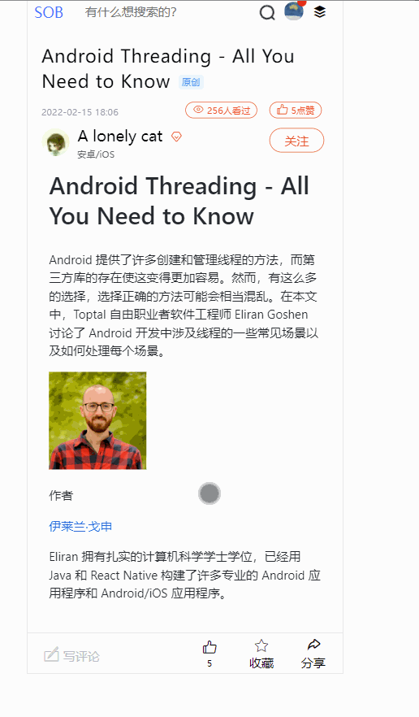
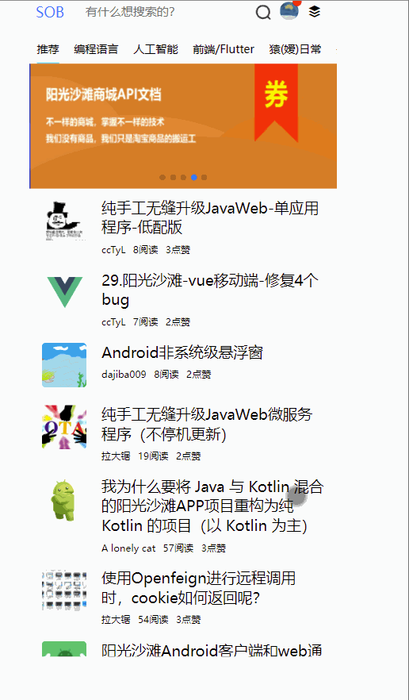
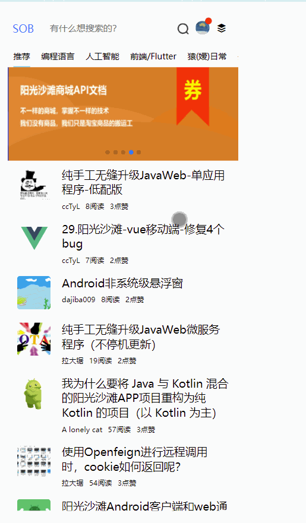
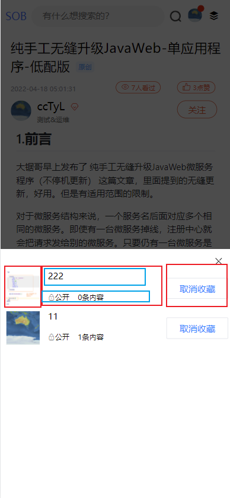

## 点赞、收藏、分享按钮功能实现

说实话，写代码的时候还比较爽，写文章就没有那么轻松了。毕竟文章写给别人看，也不知道读者需要哪些信息，我有没有漏写，以及表达方式还要整理出来。

## 1.实现逻辑

按钮位于文章详情页面的底部。逻辑相当的简单，就是点击，发请求，修改图标以及数量。

把接口罗列如下：

- 文章点赞

  这个似乎不在api文档里面，没关系。我们直接拿pc端的来使用

  `put https://api.sunofbeaches.com/ct/article/thumb-up/${文章id}`

  发送后重新获取点赞数，为什么要这样呢？因为我们看文章的时候，可能别人点赞了，如果只+1点赞数，就会出现数据不同步的问题。

  最后还要更新图标

  这里还有个小坑。之前我们是通过文章详情来获取文章的点赞数，但是现在发现文章详情接口返回的点赞数与实际的点赞数不一致，需要访问：`GET https://api.sunofbeaches.com/ct/article/check-thumb-up/1403262826952323074` 来获得真实的点赞数

- 文章收藏

  

  这个稍微复杂。

  判断是否收藏：`GET /ct/favorite/checkCollected?url=文章地址` 如果已收藏则返回收藏id 

  添加收藏：需要弹框选择收藏夹，然后把当前文章添加到指定收藏夹
  
  获取收藏夹列表： `GET https://api.sunofbeaches.com/ct/collection/list/${page}`
  
  添加到指定收藏夹：
  
  ```js
  POST  https://api.sunofbeaches.com/ct/favorite
  {
       "collectionId":"898237351115664256",
       "title":"阳光沙滩API文档",
       "url":"https://www.sunofbeach.net/a/1403262826952323074",
       "type":"0",
       "cover":""
  }
  
  collectionId：收藏夹ID
  title：收藏内容标题
  url：收藏的链接
  type：收藏类型：'0'即可
  cover：封面，可以不填写
  
  ```
  
  取消收藏 `Delete /ct/favorite/{favoriteId}`  这里的favoriteId就是我们判断是否收藏时获取的一个id
  
  
  
  最后还要更新图标。
  
- 分享

  简单的把当前页面的链接复制到剪切板即可


## 2.点赞功能

先看看效果：

 

效果很简单哈，就是点击之后图表变色。

我们开始实现。

首先，进入页面的时候，就要发起一个请求，判断该文章是否已经点赞。如果没点赞，就什么也不做，如果点赞了，那么我们需要在一进入文章的时候，就要把按钮标红，如下：

 

我们需要一个标记flag，用来记录这个文章是否已经被点赞。直接在data区声明即可 `isThumbUp:false,`，接下来编写一个方法，用于检查该文章是否被点赞：

```javascript
/**
 * 获取点赞数据并检查是否点赞
 * @returns {Promise<void>}
 */
async checkThumbUp(){
    let {code,data} = await api.checkArticleThumbUp(this.id)

    if (code===10000){
        //已经点赞
        this.isThumbUp = true
    }
    //赋值点赞数
    this.articleInfo.thumbUp = data
},
```

这个方法需要放置在mounted中，每次进入就调用一次。就可以实现进入即标红的效果。

关于标红，本质就是给图标上色。我们现在用的图标是iconfont，浏览器把他看做文字，对于这种图标，使用起来方便，并且占用带宽，资源很小。

具体实现是这样：判断isThumbUp标记，如果为真，则启用样式把文字标红。

```html
<i class="iconfont tubiao  "
   :class="isThumbUp?'icon-dianzan_kuai':'icon-dianzan'"
   :style="isThumbUp?'color: red;':''"
></i>
```

点赞，其实就是点击事件。点击之后发起请求，然后把按钮标红：

```javascript
/**
* 给当前文章点赞
*/
async thumbUp(){

    if (this.isThumbUp){
        //如果已经点赞，不做操作
        return ;
    }

    await api.articleThumbUp(this.id)

    //点赞后更新点赞数
    this.checkThumbUp()
},
```

这里thumbUp方法，直接调用checkThumbUp方法。一方面是更新按钮状态，另一方面是为了更新点赞数。因为你看文章的时候，可能别人给这个文章点赞了，所以需要得到最新的点赞数。

到这里，点赞的逻辑就完成。比较简单。

## 3.收藏功能‘

### 效果

 


### 进入时

用户进入一个文章，首先发起请求判断该文章是否被收藏。同样的，我们用一个变量来标识这个文章是否被收藏`isCollect:false`，并编写一个方法，检测这个文章是否被收藏。如果已经收藏，data就是收藏id，更新图标状态，并用另一个变量存储这个收藏id（这是为了后续的取消收藏）。如果没收藏，返回的data就是 "0" ，注意是个字符串。

```javascript
/**
 * 检测文章是否已经点赞
 * @returns {Promise<void>}
 */
async checkCollected(){
    //拼接获取该文章的主站url。
    //主站url= https://www.sunofbeach.net/a/ + 文章id
    let articleUrl = `https://www.sunofbeach.net/a/${this.id}`


    let {data} =  await api.checkArticleCollected(articleUrl)
    if (data !== "0"){

        //已收藏
        this.favoriteId = data
        this.isCollect = true
    }
},
```

### 点击时

用户点击收藏按钮，首先要弹出一个框，这个框要展示收藏夹列表。

我们首先看这个框怎么展示，这个框我们直接用的nutui的nut-popup组件，官网地址：https://nutui.jd.com/2x/#/popup 。

组件很简单，通过一个v-model的值来控制是否弹出，显然也是一个变量，我们命名为showCollectList，存储在data中。剩下的就是一些位置属性，高度等配置。不细说。

看弹出层内部，里面是一个盒子，盒子里面用v-for遍历，从而产生一堆的列表。

```html
<!--弹出层-收藏夹列表-->
<nut-popup position="bottom"
           closeable
           close-icon="cross"
           v-model="showCollectList"
           :style="{ height: '50%' }"
           close-icon-position="top-right">


        <div  class="nut-vert-list-panel">

            <div class="collect-item" v-for="item in collectList" :key="item._id" >
               ......
            </div>
        </div>
</nut-popup>
```

关于一个收藏item的设计，我画图如下：

 

整体是左右结构，flex布局，左右两边固定宽度。中间部分占用剩余宽度。对于中间部分，普通布局，上下结构，固定上面的高度，剩余宽度由下方的小字体分。比较简单的一个结构。

```html
<div class="item-left">
    
</div>
<div class="item-center">
    <div class="above">
        {{item.name}}
    </div>
    <div class="under">
        <span class="collect-perm iconfont icon-jiesuo">{{item.permission==="0"?'公开':'隐藏'}}</span>
        <span class="collect-length">{{item.favoriteCount}}条内容</span>
    </div>
</div>
<div class="item-right">
   <span class="collect-btn collected" v-if="isCollect" @click="cancelCollect">取消收藏</span>
    <span class="collect-btn" @click="collectArticle(item._id)">收藏</span>
</div>
```

样式写好之后就是数据。我们点击收藏按钮，就需要弹窗。弹窗的同时，必须发起请求，获得收藏夹数据，才能通过v-for遍历展示出来。所以我们编写方法如下，并将 openCollectList 设置到页面的点击事件当中。

```js
/**
 * 展示收藏夹列表
 */
openCollectList(){
    this.showCollectList=true
    this.getCollectList(this.currentPage,false)
},

/**
 * 获取收藏夹列表
 */
async getCollectList(page,isMerge){

    let result = await api.getCollectList(page)
    let list = result.data.content

    if (isMerge) {
        //合并之前和现在的数据
        //合并之前，涉及到一个去重问题
        let obj = {}
        for (let i = 0; i < this.collectList.length; i++) {
            obj[this.collectList[i]._id] = this.collectList[i]
        }
        for (let i = 0; i < list.length; i++) {
            //如果拿着你的id去 obj 里找，找不到，说明原本的 this.recommendArticleList没有这个对象
            if (!obj[list[i]._id]) {
                this.collectList.push(list[i])
            } else {
                // console.log(result.data.list[i].name + '不会被添加')
            }
        }
    } else {
        //更新数据
        this.collectList = list
    }

},
```

getCollectList是真正发起请求的。这里我故意留了一个合并的功能，因为收藏夹列表是分页查询的。第一页是10条记录。目前好像还没这么大的需求，所以暂时留着，方便后续分页时调用。

请求也很简单，直接调用接口，把content数据解析出来，存储到data中，页面自然开始渲染。

接下来，用户点击某个收藏夹后面的收藏按钮，这时候需要发起请求收藏该文章，于此同时，需要更新收藏按钮的图标。

```js
/**
 * 将当前文章添加到收藏夹
 * @param collectId
 */
async collectArticle(collectionId){

    /*
        拼接数据
        {
             "collectionId":"8982373991115664256",
             "title":"阳光沙滩API文档",
             "url":"https://www.sunofbeach.net/a/1403262826952323074",
             "type":"0",
             "cover":""
        }

     */
    let data = {
        collectionId:collectionId,
        title:this.articleInfo.title,
        url: this.getArticleOnPcUrl(),
        type:"0"
    }

    let result =  await api.collectArticle(data)
    if (result.code ===10000){
        this.$notify.success('收藏成功！');
        //成功之后要收起收藏夹列表
        this.showCollectList=false

        //更新图标
        this.isCollect=true

        //重新获取收藏的id
        this.checkCollected()

    }else {
        this.$notify.danger('收藏失败！');
    }
},
```

收藏成功之后，接口不会返回收藏id，这时候需要手动调用一次检查收藏夹的方法checkCollected()，获得收藏id。

最后，操作完毕，我们需要关闭弹出层。这时候按钮应该变色了。

这个收藏状态非常好改，因为我们把标记存储在data中，修改data的值，页面会重新根据这个值来渲染。所以按钮部分我们加了个判断，如果已收藏就改变颜色：

```html
 <span class="collect btn" @click="openCollectList">
                    <i class="iconfont tubiao "
                       :class="isCollect?'icon-shoucang3':'icon-shoucang2'"
                       :style="isCollect?'color: #0084ff;':''"
                    ></i>
                    <span class="desc">收藏</span>
                </span>
```

另外，收藏之后再重新打开收藏夹列表，按钮的文字和颜色就应该发生变化，这个也是根据收藏标记来展示的。

### 小坑

这里有个小坑，大家看gif时会发现，我只收藏到一个收藏夹，但是两个收藏夹的按钮都变色了，这是为什么呢？因为后端不会告诉你，这个文章被收藏到哪个收藏夹了。估计是bug。

### 取消收藏

重新打开收藏夹列表，允许取消收藏。随便点一个收藏夹后面的按钮就可以。因为sob设计时，似乎认为一个文章只会存在于一个收藏夹内部，所以传参时不需要传递收藏夹id，只传递收藏记录的id，这个估计后面会修复。

我们直接给取消收藏按钮加上点击事件，点击后触发方法：

```js

            /**
             * 将当前文章取消收藏
             * @returns {Promise<void>}
             */
            async cancelCollect(){
                let result =  await api.cancelCollect(this.favoriteId)
                if (result.code===10000){
                    this.$notify.success(result.message)
                    //成功之后要收起收藏夹列表
                    this.showCollectList=false

                    //更新图标
                    this.isCollect = false
                }else {
                    this.$notify.danger(result.message)
                }
            },
```

即可完成取消收藏。

### 禁止多次收藏

在sob主站，允许一个文章多次收藏，但是会如果一个文章被同一个收藏夹收藏多次，或者被不同的文件夹收藏多次，检查是否收藏的接口就会报错，这时候我们的客户端是没法展示的。所以我们这里不允许多次收藏，一旦收藏了就只能取消，不能再次收藏


## 4.文章分享

逻辑：把文章链接复制到剪切板即可。

其他太复杂的分享方式暂时不做。

分享的链接采用主站的链接，因为现在移动端还没有域名，没法分享移动端的链接。

给分享按钮添加点击事件，方法如下：

```js
/**
 * 分享文章。将主站的文章链接拷贝到内存中
 */
shareArticle(){
    //生成链接
    let url = this.getArticleOnPcUrl()

    //复制到剪切板
    easyCopy(url)

    //提示
    this.$notify.success("链接已复制到剪切板，快去分享把！")
},

/**
 * 获取文章的主站链接
 */
getArticleOnPcUrl(){
    return `https://www.sunofbeach.net/a/${this.id}`
},
```

关于复制，我单独分开一个工具类。说起来浏览器读写剪切板的方式挺奇葩的，先创建一个input，粘贴内容，执行copy命令，这样才到的剪切板。工具类单独放到了util目录，大家可以去github上具体查看

easyCopy.js

```js
export default function easyCopy(text) {

    const input = document.createElement('INPUT');
    input.style.opacity = 0;
    input.style.position = 'absolute';
    input.style.left = '-100000px';
    document.body.appendChild(input);

    input.value = text;
    input.select();
    input.setSelectionRange(0, text.length);
    document.execCommand('copy');
    document.body.removeChild(input);
    return true;


}
```


## 5.源码

参考https://github.com/cctyl/sunofbeach_mobile 
