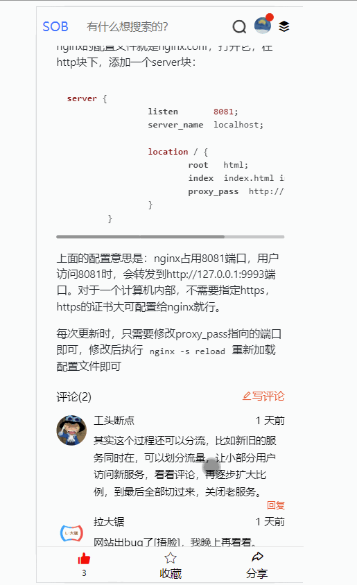
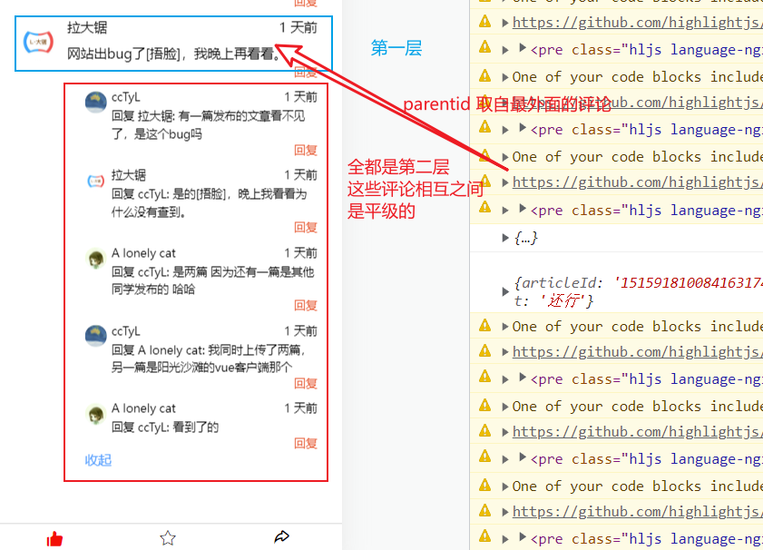
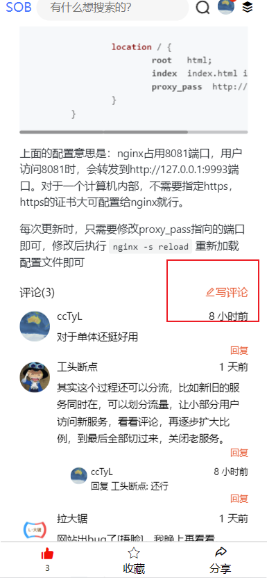

## bug修复、实现文章评论功能

## 一、bug修复

- 评论的回复数只有一条时，不会显示回复

  其实是文章详情页面 ，reviewRight 部分，判断时`item.subComments.length>1`,当时设计的时候好像是是打算，太少了就不用隐藏。结果后面忘了。改成`item.subComments.length>=1`，然后加一个判断，等于1时不用展示更多评论按钮，就可以了。

## 二、评论功能

### 功能分析

我们要实现的最终效果展示如下：

 

可以看到，我们把之前底部的评论窗口挪走了。评论的填写位置改为弹窗。

这个评论有分类。

第一种就是针对文章本身的评论，使用的接口是`post /ct/article/comment`,参数为：

```js
 {
    parentId: '0',
    articleId: 文章id,
    commentContent: 评论内容
}
```

可以看到只需要传递文章id和文章内容即可，是比较简单的。

第二种就是回复别人的评论，使用的接口是`post /ct/article/sub-comment`,参数较多：

```js
 {
    articleId: 文章id,
    parentId: 被回复的评论id,
    beUid: 被回复的用户id,
    beNickname: 被回复的用户的名称,
    content: 回复内容
}
```

这里比较坑啊。因为评论下面还有子评论，子评论又还可以再评论，那么这个parentid到底是谁的id呢？其实是文章评论的id，也就是最外面那条，原本针对文章评论的id。

所以别看子评论还可以被回复，但是他们实际是并列的。评论总共只有两层，第一层就是回复文章的评论，第二层就是回复。示意图如下：

 


写好评论，发起请求时，还需要判断下，到底是针对文章的评论，还是针对某用户的二级评论。使用的接口不一样。


### 弹窗的实现

弹窗，仍然使用nutui的组件。面板内也比较简单。当然，这个弹窗也是通过一个flag  `showCommentPanel`来控制的，就是一个文本域输入框，输入内容用双向绑定直接传输到data。一个按钮。按钮按下后提交数据。具体的评论层级判断交给submitComment方法，这里只负责展示。

两种层级的评论，都是使用同一个弹窗。因为输入框不需要变化，变化的是要提交的接口。

当然，两个层级还是有一点点不同，就是提示文字。二级评论我回复一个人时，文本框内展示被回复的用户的名字

```html
 <!--弹出层-评论框-->
<nut-popup position="top"
           v-model="showCommentPanel"
           >

    <!--评论填写框-->
    <nut-textbox
                 class="comment-input"
                 v-model="commentStr"
                 :place-text="commentPlaceText"
                 :max-num="300"
                 :txt-area-h="80"
                 ></nut-textbox>
    <nut-button
                @click="submitComment"
                class="comment-submit-btn"
                block
                >
        提交
    </nut-button>

</nut-popup>
```


### 一级评论

针对文章的评论。首先是用户点击 “写评论” 按钮。 

只有这个按钮打开的弹窗是评论文章本身的，回复按钮都是针对二级评论。

点击 写评论 按钮，执行对应点击事件openCommentPanel。

首先判断是否已经登录，然后清空可能会存在的旧数据（只需要令v-model对应的对象为''），然后需要设置一下提示文字。对于一级评论，不需要添加回复谁，所以写一段固定的文本即可，最后就是令 showCommentPanel 这个标记为true，就会展示弹窗

```js
/**
 * 展示评论填写框
 */
openCommentPanel(isSubComment){
    if (!this.isLogin(this)){
        return
    }
    //清空旧数据
    this.commentStr = ""
    this.commentPlaceText="说说你的看法吧！"
    this.showCommentPanel=true
},
```

当用户编写完评论，点击提交时，触发对应点击事件submitComment。这里逻辑简单，把数据拼装好，调用接口。判断响应，如果正确则做出提示，关闭弹出。

```js
 //给文章评论
let data = {
    parentId: '0',
    articleId: this.id,
    commentContent: this.commentStr,
}

let result = await api.addArticleComment(data)
if (result.code===10000){
    this.$notify.success(result.message)

    //清空评论框
    this.commentStr=''
    //关闭弹窗
    this.showCommentPanel=false
    //获取评论列表
    this.getCommentList()


}else {
    this.$notify.warn(result.message)
}
```


### 二级评论

首先我们就需要把 '回复' 按钮添加到页面中，这个按钮点击之后，我们需要知道他到底要回复谁，我们必须知道他要回复谁，所以在触发点击事件的时候需要把这个评论的对象拿过来，那么按钮写成这样：

```html
<span
    @click="openCommentPanel(true,item)"
>回复</span>
```

要注意这个item。因为我们遍历的时候有两层，有些是写第一层的item，有些是写第二层的item，具体大家看看源码。

同时我们也修改openCommentPanel方法，第一个参数表示，你是否是回复子评论，第二个参数就是评论的相关信息。

```js
/**
 * 展示评论填写框
 */
openCommentPanel(isSubComment,commentObj){
    if (!this.isLogin(this)){
        return
    }
    //清空旧数据
    this.commentStr = ""

    //更新标记，回复对象不同，接口不一致
    this.isSubComment = isSubComment  //标记，此时是二级评论
    this.subCommentInfo = commentObj  //记录此评论的信息，等会提交时组装参数需要用到

    if (this.isSubComment){
        //回复评论时，需要携带一些参数 例如：A lonely cat  回复 @ccTyL
        //最终会展示在文本框中
        let beReplayUserName = commentObj.yourNickname || commentObj.nickname
        this.commentPlaceText=`回复 @${beReplayUserName}`
    }else {
        this.commentPlaceText="说说你的看法吧！"
    }

    this.showCommentPanel=true

},
```

当用户打开了弹窗，编写完毕后，点击提交，调用submitComment。这个方法同样进行改造。

加上一个判断，通过isSubComment标记来决定到底是回复文章，还是回复指定的评论。

而回复评论，最复杂就是参数的组装。因为你可以回复一级评论，也可以回复二级评论，最后你的回复会变成二级评论。这样的话，我们拿到的评论对象中的属性是不一致的。

当我们回复一级评论，parentid就是这条评论的id，用户id是userId，用户名是nickname

当我们回复二级评论是，parentId 就不是这条评论的id，因为回复的是二级评论，我们产生的也是二级评论，这样是平级，不能把它作为parent。所以这里的parentId就应该是 这条被回复的二级评论的parentId。简单的说，这条评论和被回复的评论，有共同的parent。这时候的uid啊，nickname的属性啊，都有变化，所以单独设置。

`this.subCommentInfo.yourUid || this.subCommentInfo.userId` 这种是熔断的写法，如果第一个满足，就不会执行第二个，值就是第一个。如果第一个不满足，那么就执行第二个，不管第二个满不满足，反正值都是它了。

```js
/**
 * 提交评论
 */
async submitComment(){

    if (this.isSubComment){
        //回复评论
        let data = {
            articleId: this.id,
            parentId: this.subCommentInfo.parentId==="0"?this.subCommentInfo._id:this.subCommentInfo.parentId,
            beUid: this.subCommentInfo.yourUid || this.subCommentInfo.userId,
            beNickname: this.subCommentInfo.yourNickname || this.subCommentInfo.nickname,
            content: this.commentStr
        }

        console.log( this.subCommentInfo)
        console.log(data)

        let result = await api.addArticleSubComment(data)
        if (result.code===10000){
            this.$notify.success(result.message)

            //清空评论框
            this.commentStr=''
            //关闭弹窗
            this.showCommentPanel=false

            //获取评论列表
            this.getCommentList()

        }else {
            this.$notify.warn(result.message)
        }
    }else {
        //给文章评论
        let data = {
            parentId: '0',
            articleId: this.id,
            commentContent: this.commentStr,
        }

        let result = await api.addArticleComment(data)
        if (result.code===10000){
            this.$notify.success(result.message)

            //清空评论框
            this.commentStr=''
            //关闭弹窗
            this.showCommentPanel=false
            //获取评论列表
            this.getCommentList()


        }else {
            this.$notify.warn(result.message)
        }
    }


},
```


## 三、源码

文章中没有把全部代码写全，详情参看完整的源码 https://github.com/cctyl/sunofbeach_mobile 