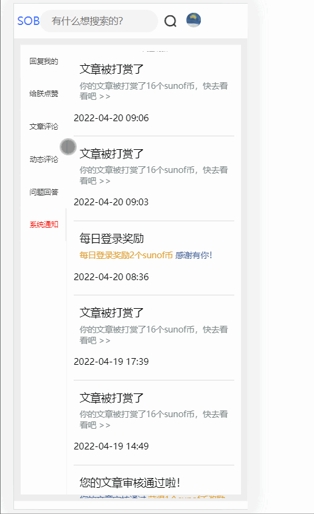
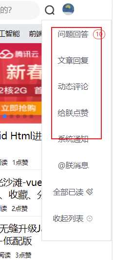
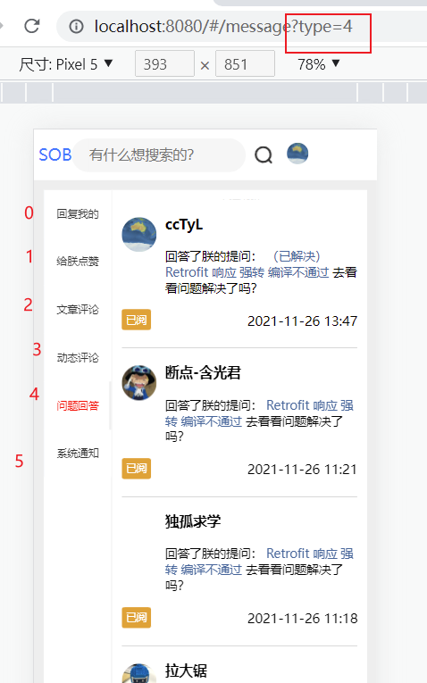
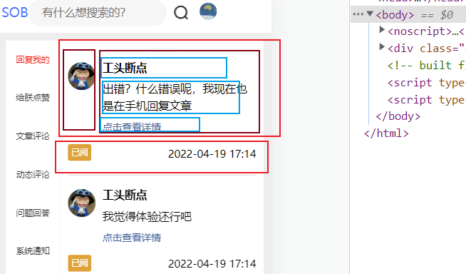
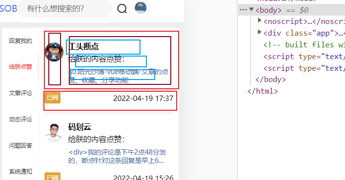

## 消息查看页面

## 一、说明

这个页面其实之前完成了一半了，后面又搁置了好一段时间。现在回头一看发现也有点乱，重新梳理一遍，并把剩余的功能给添加上。

整个页面的预计效果如下：

 


## 二、实现

### 页面结构

分析下流程：

首先用户进入首页，点击头像打开下拉菜单，点击任意菜单项跳转到消息详情页面

 

跳转时，会携带tab数据，type=xxx ，这个type就是tab的index。比如type=0，那就打开第0个tab，也就是回复我的。

 

消息详情页面我们是使用nut-tab组件，这个组件分为左右两部分，左侧就是普通的文本，标识当前页。右边是一个list，嵌套存放消息数组。

同时，右侧我们还嵌套了nut-scroller，这是为了实现下拉刷新，无缝加载的功能，那么整体页面结构如下所示：

```html
    <nut-tab :is-scroll="true" position-nav="left" :wrapper-height="tabHeight" :def-index="currentTab"
             @tab-switch="tabSwitch"
    >
        <nut-tab-panel tab-title="回复我的">
            <nut-scroller
                    :type="'vertical'"
                    :is-un-more="isUnMore"
                    :is-loading="isLoading"
                    @pulldown="pulldown"
                    unloadMoreTxt="到底了"
                    @loadMore="loadMoreVert"
                    :init-data="msgList"

            >
                <div slot="list">
                    <li v-for=xxx>这里就是具体的消息项</li>
                </div>
                
            </nut-scroller>
        </nut-tab-panel>
</nut-tab>
```

这个整体的结构，每个tab都是相同的，但是不同的tab，消息格式是不一样的，大家从上面的gif中可以看出，比如系统通知，就没有头像。

这就意味着，每个tab对应的消息项，都需要我们进行调整，当然，这个调整不会很大，大同小异。以 “回复我的” 这一栏为案例，他的结构是这样的： 上下结构里面嵌套左右，里面再嵌套上下

 

“给朕点赞” 页面也差不多

 

结构设计成：

```html
<li class="mli" v-for="comment in msgList" :key="comment._id">

    <div class="mItem">
        <div class="mleft">
            <!--用户头像-->
            
        </div>
        <div class="mRight">
            <div class="nickname">用户名</div>
            <div class="content">回复内容/其他描述</div>
            <div class="title">文章标题</div>
        </div>
    </div>

    <div class="mBottom">
        <span class="readStatus">已读</span>
        <div class="mTime">时间</div>
    </div>
</li>
```

结构还是比较的清晰。

那么具体的item怎么改，这个需要我们自己对照着接口返回的数据去修改。比如时间，有的是叫 publisTime，有些是叫thumbUpTime，需要单独取出。

### 数据获取

接下来说说数据来源，每个tab对应的数据都是不一样的，接口不同，返回的数据中字段名，字段数量也不一致。所以，我们需要单独判断当前是什么tab，发起不同的请求。

流程：点击左侧的tab，一定会得到一个tabindex，这时候调用一个函数，定义为 tabSwitch（组件自带的回调），更新当前所在的tabIndex。接下来就要发起请求获取数据。

```js
/**
 * 切换了tab
 */
tabSwitch(val) {
    //更新tab索引
    this.currentTab = val;

    //切换后刷新数据
    this.getMsgData()

},
```

我们调用自定义的getMsgData(page,isMerge) 方法。该方法通过switch判断tabIndex，然后调用对应的接口获得数据。所有接口的数据层次是一致的，只有到对应的item字段才不一致。所以我们统一存储到data的msgList。这里数据就基本拿到了，页面此时已经可以针对性的展示数据。

因为我们预留了 下拉刷新，无缝加载功能，所以getMsgData方法仍然需要判断是否需要合并。如果是刷新那就直接替换，如果是下拉加载那就去重合并。

```js
/**
 * 获取消息列表，具体调用什么api取决于当前所在tab
 * @param page 当前页码数
 * @param isMerge 是否将新数据和并到旧数据中
 *
 */
async getMsgData(page = 1, isMerge = false) {
    //请求结果
    let result = {}

    //不同的tab访问的api是不一样的，根据tab调用不同的接口即可
    switch (this.currentTab) {

        case 0:{
            //回复我的
            result = await api.getAtMessage(page)
            break
        }
        case 1:{
            //点赞数据

            result = await api.getThumbMessage(page)
            break
        }
        case 2: {
            //文章评论
            result = await api.getArticleMessage(page)
            break;
        }
        case 3:{
            //动态评论
            result = await api.getMomentMessage(page)
            break
        }
        case 4:{
            //问题回答
            result = await api.getWendaMessage(page)
            break
        }
        case 5:{
            //系统通知
            result = await api.getSystemMessage(page)
            break
        }


    }
    console.log(result)
    //取出评论列表
    let msgList = result.data.content

    //取出总页数
    this.totalPages = result.data.totalPages

    if (isMerge) {
        //合并之前和现在的数据
        //合并之前，涉及到一个去重问题
        let obj = {}
        for (let i = 0; i < this.msgList.length; i++) {
            obj[this.msgList[i]._id] = this.msgList[i]
        }
        for (let i = 0; i < msgList.length; i++) {
            //如果拿着你的id去 obj 里找，找不到，说明原本的 this.msgList没有这个对象

            if (!obj[msgList[i].id]) {
                this.msgList.push(msgList[i])
            } else {
                // console.log('不会被添加')
            }
        }
    } else {
        //更新数据
        this.msgList = msgList
    }


},
```

另外，加上两个方法来实现下拉刷新和无缝加载。本质就是更新下页码，然后调用getMsgData，没有复杂的逻辑。但是用到了一个简单的 函数节流。防止用户疯狂下拉，导致接口多次发出请求。这是限制一段时间内只能下拉一次，那么就只会发一次请求。大家到时候可以尝试下，疯狂下拉，但是不会频发发起请求。

```js
/**
 * 下拉刷新
 */
pulldown() {

    this.isLoading = true

    //根据当前所在tab刷新数据
    this.getMsgData()

    //函数节流
    clearTimeout(this.timer)
    this.timer = setTimeout(() => {
        this.isLoading = false
    }, 300)
},


/**
 * 上拉加载更多
 */
loadMoreVert() {
    //判断是否还有下一页
    if (this.currentPage >= this.totalPages) {
        //如果当前页码已经大于 或者等于最大页码数，那就不加载下一页
        // console.log("到底了")
        this.isUnMore = true
        return
    }

    this.isUnMore = true


    //根据当前所在tab刷新数据
    this.getMsgData(++this.currentPage, true)

    clearTimeout(this.timer)
    this.timer = setTimeout(() => {
        this.isUnMore = false
    }, 300)

},
```


### 一些样式的调整

之前右侧的宽度没有固定，就会被内容的多寡而影响宽度。现在右侧消息详情整体宽度固定了，一些字体大小也调整了，详情大家自己看看源码

### 待完成

目前只展示了消息详情，但是点击消息并不能跳转到页面的具体位置，留到之后再做。


## 三、源码

 https://github.com/cctyl/sunofbeach_mobile 