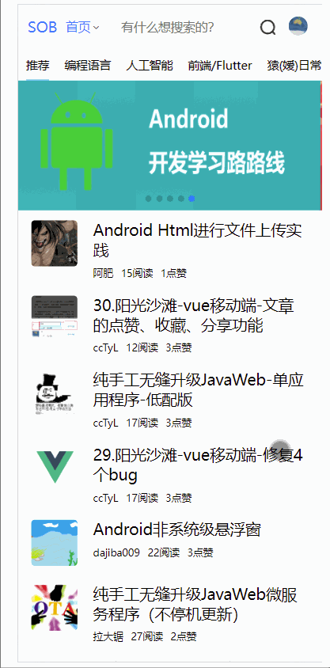
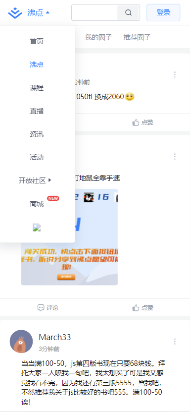
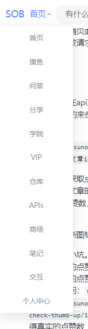

## 顶部栏ui优化、导航栏添加

## 一、说明

本次更新内容：

- 添加导航栏，去除nutui的nutrow组件
- 优化消息列表的ui
- 解决导航栏以及消息列表的收起问题

下面看效果：



## 二、导航栏添加

导航栏位于logo后面以及搜索框前面，ui参考自掘金。

 

实现导航栏之前，先把原有的结构整理清楚。以前我们的导航栏是使用nut-row来均分，这个组件对于盒子之间的间隔不太好控制，比较生硬，不能随着盒子大小而变化。决定把他去除。去除很简单，就是把套在外面的nut-row，nut-col 标签全部去掉。去掉之后，给顶部栏外层的container盒子加上flex属性：

```css
.container {
    padding: 10px 5px;
    display: flex;
    flex-direction: row;
    justify-content: space-between;
}
```

接下来调整搜索框的大小，它不需要这么长，缩小一些给导航栏留下位置。

准备工作做完，接下来分析html的结构。

对于这样一长串东西，本质是包含在一个父盒子里面的

 

结构和之前的消息盒子很像，看下面的代码和注释说明。

```html
<!--侧边栏-->
<div class="side">
    <!--这个就是展示在顶部的按钮-->
    <div class="nav-show-btn" @click="setNavListShow(!navListShow)">
        <!--具体的板块名字-->
        <span class="nav-title">{{navText}}</span>
         <!--箭头图标-->
        <i class="iconfont"
           :class="navListShow?'icon-shangzhankai':'icon-xiazhankai'"
        />
    </div>
    <!--这个就是导航菜单盒子，ul下面有多个li，一个li就是一个项-->
    <ul class="nav-list" v-show="navListShow">
        <li class="nav-item">
            <!-- li内部嵌套一个a标签，如果当前页面就是本导航菜单，则需要把a标签高亮。
			我们通过一个nav-active属性来修改文字颜色实现高亮
			-->
            <a
                    :class="{'nav-active': $route.path==='/home' }"
            >首页</a>
        </li>
         <li class="nav-item">
            <a
                    :class="{'nav-active': $route.path==='/home' }"
            >摸鱼</a>
        </li>
     	......
    </ul>

</div>
```

对于nav-list，怎么控制展示和隐藏呢？我们使用了一个标记navListShow来控制，这个标记会存储到 vuex中，后面讲到。

nav-list展示的时候，是悬浮在上面的。这个效果是通过定位来实现。直接给nav-list加上定位`position: absolute;`,因为他的父亲没有加定位，所以它会把最外层的窗口，html作为父窗口。再加上 `left: 0;`就会紧挨着左边。此时显示会被其他页面覆盖，所以还需要抬高层级`z-index: 2;` 。这样大体结构就完成了，样式再调整一下就可以实现了。

在调整样式的时候，大家会发现导航列表和右侧的消息列表结构非常相像，把navlist的样式基本照搬到msglist即可同时优化。


## 三、导航栏以及消息列表的收起问题

一般来说，我们打开了一个下拉列表，点击页面其他地方，就应该把列表给隐藏。gif中多次演示了这种场景。

之前的版本中一直没有实现，因为我们通过是一个标记来控制下拉列表的展示隐藏，想要隐藏就需要修改标记。

如果是点击页面其他地方，就要关闭下拉列表，那么我们就需要 

- 点击其他页面，要修改这个标记的话，就需要跨组件访问标记。

- 感知到 页面的其他地方被点击了


跨组件的访问数据，干脆我们把nav-list和msg-list的标记交给vuex管理。这样不管到哪个组件，我们都可以访问到它。

对state.js添加属性：

```js
/*
存放各种需要共用的属性
 */
export default {

    lastUrl:'',//记录上一次请求的url，用于登录后返回
    userInfo:'',//用户信息
    msgBoxShow: false,//决定是否展示消息盒子
    navListShow: false,//是否展示导航菜单
}
```

对mutations.js 添加函数

```js
/*
    直接操作state的地方
 */
export default {

	......
    
    SET_MSG_BOX_SHOW(state,value){
        //修改state
        state.msgBoxShow=value
    },

    SET_NAV_LIST_SHOW(state,value){
        //修改state
        state.navListShow=value
    },

}
```

对actions.js添加函数

```js
/*
通过操作mutations来操作state
 */
import api from '../api/index'

export default {

    ......
    
    /**
     * 设置msgBoxShow属性
     * @param context
     * @param value
     */
    setMsgBoxShow(context, value) {
        //commit
        context.commit('SET_MSG_BOX_SHOW', value)
    },

    /**
     * 设置navListShow属性
     * @param context
     * @param value
     */
    setNavListShow(context, value) {
        //commit
        context.commit('SET_NAV_LIST_SHOW', value)
    },


}
```

接下来，页面上取出state的两个标记，我们使用mapState ，这个是为了让我们少写一些前缀。

在Header.vue引入 `import {mapState} from 'vuex' `, （其实之前已经引入过了）在computed里面加上 `...mapState(['userInfo','msgBoxShow','navListShow']),`，然后页面取值就直接取msgBoxShow 以及navListShow 作为控制显示隐藏的标记。

针对第二点，目前我暂时不知道怎么样 ***优雅的实现***  感知其他地方的点击。所以采用low一点的办法，给页面加上@click 来感知点击事件。low的方式就会有一些弊端，需要在比较多的地方加上这个点击事件。就拿顶部栏来说，除了两个下拉列表，其他地方都需要加上@click，对于下方的主要页面，全部都要加上点击事件。当然，不需要每个页面都加，给他们的外壳加上onclick即可。那么接下来，onclick触发的事件具体要做什么？无非就是操作action的方法，把两个标记： msgBoxShow 以及navListShow  都设置为false。

显然，这样一个方法，特点是：执行多次，多个组件都会调用。 这种情况下，显然应该写成全局函数。同样的，我们写到之前提到的插件当中。打开moreFunction.js，添加方法如下：

```js
/**
 * 这是一个插件
 * 是为了提供一些全局方法而定义的
 */
export default {
    //这个install方法会被调用，并且传入 Vue构造函数
    install(Vue) {

        ......
        
        /**
         * 关闭导航栏以及消息列表
         */
        Vue.prototype.closeNavMsg = function () {
            this.$store.dispatch('setMsgBoxShow',false)
            this.$store.dispatch('setNavListShow',false)
        }
    }
}
```

方法写好了，接下来就是调用。给header组件上的盒子都加上  @click="closeNavMsg()" ,如果已经有了click事件，就在事件里调用`this. closeNavMsg()`。这样顶部栏就完成了。针对下方的内容区域，打开App.vue，在router-view上加上点击事件，因为所有的内容都是替换router-view来展示的。

```html
<template>
    <div class="app">
        <!--顶部栏  -->
        <Header v-show="$route.meta.showHeader"></Header>
		<!--因为router-view没有click事件，所以要加上native  -->
        <router-view @click.native="closeNavMsg()"></router-view>

    </div>
</template>
```

到这里，基本效果就实现了

## 四、源码

https://github.com/cctyl/sunofbeach_mobile 