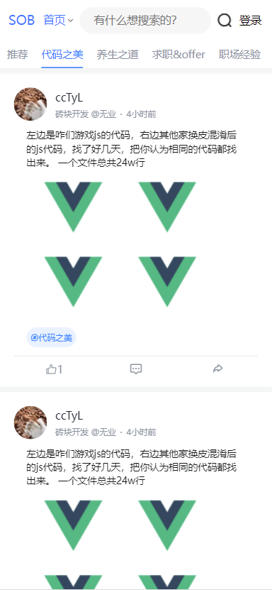
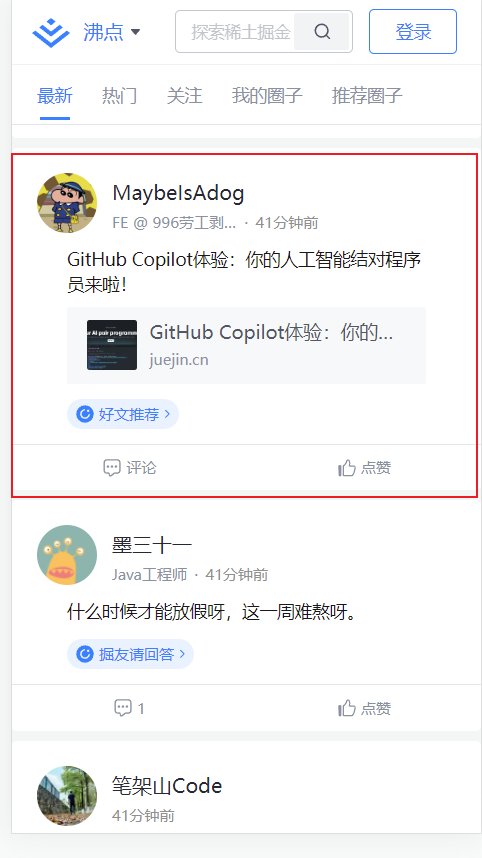
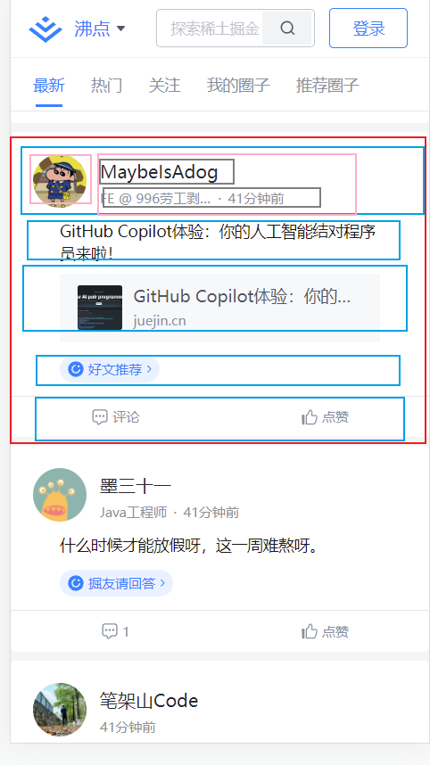

## 1.说明

终于做到这个页面了，是客户端相当重要的一个功能，就是方便发动态和看动态。

本节我们先把大体的html结构搭建起来，之后再往里填充数据。

补充一下，其实系统中包含了很多细小的bug，这些bug一般在添加新功能的时候我顺手就修复了，但是没有单独的写在文章里，所以要是发现页面效果和之前所说的不一致，那是因为我做了一些微调，改动不会很大，可以自己参考代码进行调整。

## 2.主体框架

先来看看效果图：

 

整体分为两块内容，一个是话题栏，使用nutui的滑动组件，组件里面是一个个的span。一个就是摸鱼列表，仍然使用nutui的滑动组件，组件里面是一个list。list中每一个item就是一条摸鱼动态。摸鱼动态具体结构我们先不说，先看看主体结构。

其实你会发现，这个摸鱼页面的总体结构，和首页是非常相像的。因此呢，我们把主页的html结构拿过来，去掉细节，相关的下拉刷新，无缝加载的配置和函数也可以一起复制过来，下一节对函数进行具体的实现。

那么我们把大体结构复制过来，修改得到如下：

```html
<template>
    <div class="container">

            <!--标签栏-->
            <nut-scroller class="tagScroll"
                          :scrollTo="tagScrollY"
                          @scrollToCbk="tagScrollToCbk"
            >

                <div slot="list" class="tagItem nut-hor-list-item " :class="{tagCurrent: currentTag==-1}"
                     @click="changeTag(-1,'recommend')"
                >
                   <!-- 这里存放具体的话题item -->              
                </div>
            </nut-scroller>
        
			<!-- 这个是分割线，用于美化ui -->              
            <div class="line"></div>
            <nut-scroller
                    ref="mynutscroller"
                    :scrollTo="momentListScrollY"
                    type="vertical"
                    class="totalScroll"
                    @loadMore="loadMoreVert"
                    @pulldown="pulldown"
                    @scrollChange="scrollChange"
                    :is-un-more="isUnMore"
                    :is-loading="isLoading"
                    @scrollToCbk="scrollToCbk"
                    unloadMoreTxt="加载中"
            >
                <div slot="list" class="moment-list">


                    <div v-for="item in momentList" :key="item.id">
                        <li class="moment-item">
							<!-- 这里存放具体的摸鱼动态 -->                         
                        </li>
                    </div>
                </div>
            </nut-scroller>
    </div>
</template>
```


## 3.话题item

话题的item相当的简单，就是一个span，和首页的一样，只是填充不同文字。做这部分的时候，我顺手把首页的和摸鱼页面的话题容器颜色改了，改成了蓝色，比较符合sob的主体色，具体的css样式大家看代码。

```html
<!--标签栏-->
<nut-scroller class="tagScroll"
>

    <div slot="list" class="tagItem nut-hor-list-item " :class="{tagCurrent: currentTag==-1}"
    >
        <span class="tagTitle">推荐</span>
    </div>

    <div slot="list" class="tagItem nut-hor-list-item "
         :class="{tagCurrent: currentTag==index}"
         v-for="(item,index) in categoryList" :key="item.id"
    >
        <span class="tagTitle">{{item.topicName}}</span>
    </div>

</nut-scroller>
```

我们通过 currentTag来记录当前所在的topic，与index进行对比，只要相同，就加上高亮颜色  ` :class="{tagCurrent: currentTag==index}"`.

关于样式的修改，这部分我写的比之前的页面都要清晰了，主要用到了这些样式

```css
    /*---------------标签栏 ---------------*/
    .tagScroll {
        white-space: nowrap;
        height: 40px;
    }

    .tagItem {
        box-sizing: border-box;

        height: 40px;
        line-height: 40px;
        text-align: center;

        font-weight: bold;
        font-size: 15px;
        margin: 0 10px;
        color: #8a919f;
    }

    /*当前被选中的tag*/
    .tagCurrent {
        border-bottom: 2px solid #1e80ff;
        margin-bottom: 1px;
        color: #1e80ff;
    }

```

如果想要修改nutui本身的样式，直接写有时候会不生效。这时候你需要这样：

在vue文件的底部，另外加上一个style标签，这个标签不能加上scope作用域，在这里写的样式就可以覆盖掉原本nutui的样式，当然，这个样式因为没有加上作用域，所以所有页面都会被这个样式影响，因此添加要慎重。

```html
<template>
	...
</template>

<style scope>
    ...
</style>

<style >
    <!--在这里写样式，可以覆盖nutui原本的样式-->
</style>
```

或者，可以使用scss来写样式，这样可以强制写入。


## 4.具体摸鱼动态

我们参考掘金：



整体结构是这样的：

 

先上下，具体细节采用左右结构。

对于上下结构，直接摆放就可以，一个盒子放一行。对于左右结构，也就是行内的列，使用flex布局让他水平摆放，在调整一下宽高即可。具体结构如下：

```html
<nut-scroller

        ref="mynutscroller"

        :scrollTo="momentListScrollY"
        type="vertical"
        class="totalScroll"
        @loadMore="loadMoreVert"
        @pulldown="pulldown"
        @scrollChange="scrollChange"
        :is-un-more="isUnMore"
        :is-loading="isLoading"
        @scrollToCbk="scrollToCbk"
        unloadMoreTxt="加载中"
>
    <div slot="list" class="moment-list">
     
        <li class="moment-item"  v-for="item in momentList" :key="item.id">

            <!--第一行-头部以及用户信息-->
            <div class="header">
                <div class="avatar">
                    
                </div>
                <div class="userinfo">
                    <div class="nickname">{{item.nickname}}</div>
                    <div class="desc">
                        <div class="post">{{item.company?item.company:'无业'}}
                            @{{item.position?item.position:'正在定位中'}}
                        </div>
                        <div class="dot">·</div>
                        <div class="publish-time">{{item.createTime}}</div>
                    </div>
                </div>
            </div>
            
             <!--第二行 - 具体的动态内容。包含的类型比较多：文本，图片，链接，话题
				每个内容用一个div盒子包裹
			-->
            <div class="middle">

                <!--动态内容-->
                <div class="content" v-html="item.content"></div>

                <!--图片列表-->
                <div class="img-list" v-if="item.images.length>0">
                    <!--图片使用背景图片的形式，并且禁止缩放-->
                    <div
                         v-for="(img,index) in item.images" :key="img"
                         class="bg-img"
                         v-bind:style="{backgroundImage:`url('${img}')`}">
                    </div>
                </div>

                <!--分享的链接-->
                <div class="link-box" v-if="item.linkUrl">
                    <a :href="item.linkUrl">

                        <!--如果这个链接有封面-->
                        <div class="link-cover"
                             v-if="item.linkCover"
                             v-bind:style="{backgroundImage:`url('${item.linkCover})`}"
                             >
                        </div>

                        <!--没有封面的情况下，用一个背景色块代替-->
                        <div class="link-cover-default" v-else >
                            <i class="iconfont icon-link"></i>
                        </div>

                        <!--这是链接的标题-->
                        <div class="link-info">
                            <div class="link-title">{{item.linkTitle?item.linkTitle:'-'}}</div>
                            <div class="link-domain">{{item.linkHost}}</div>
                        </div>
                    </a>
                </div>

			  <!--这个就是话题-->
                <div class="topic" v-if="item.topicName" >
                    <i class="iconfont icon-topic">{{item.topicName}}</i>
                </div>

            </div>
            
            <!--第三行-点赞评论分享等按钮-->
            <div class="action">
                <i class="action-btn iconfont icon-dianzan"
                   :class="{active:item.thumbUpActive}"><span style="padding: 0px 5px">{{item.thumbUpCount}}</span>				 </i>
                <i class="action-btn iconfont icon-pinglunxiao">
                    <span style="padding: 0px 5px">{{item.commentCount}}</span>
                </i>
                <i class="action-btn iconfont icon-fenxiang1"></i>
            </div>
        </li>
    </div>
</nut-scroller>
```

结构也是很简单的哈，我们先把结构做起来，后面再把数据，点击后的行为等做上去，先有个架子。

样式如下：

```css
   /*---------------动态详情 ---------------*/

    .moment-item {
        padding: 20px 20px 0;
        margin-bottom: 8px;
    }

    .moment-item .header {
        display: flex;
        flex-direction: row;
    }

    .moment-item .header .avatar {
        width: 3rem;
        height: 3rem;
    }

    .moment-item .header .avatar img {
        width: 3rem;
        height: 3rem;
        border-radius: 50%;
    }


    .moment-item .header .userinfo {
        margin-left: 12px;

        height: 50px;
    }

    .moment-item .header .userinfo .nickname {
        font-size: 16px;
        line-height: 28px;
        font-weight: 500;
        color: #252933;
    }

    .moment-item .header .userinfo .desc {
        display: flex;
        flex-direction: row;
        font-size: 12px;
        line-height: 20px;
        color: #8a919f;

    }

    .moment-item .header .userinfo .desc .post {
        width: 100px;
        overflow: hidden;
        text-overflow: ellipsis;
        white-space: nowrap
    }

    .moment-item .header .userinfo .desc .dot {
        margin: 0 0.5em;
    }


    .moment-item .middle {
        margin: 8px 24px 0 18px;
    }

    .moment-item .middle .content {
        font-size: 14px;
        color: #17181a;
        overflow: hidden;
        line-height: 20px;
    }

    .moment-item .middle .img-list {
        display: flex;
        flex-wrap: wrap;
        margin-bottom: 10px;
    }

    .moment-item .middle .img-list img {
        margin-right: 4px;
        margin-top: 4px;
        width: calc(43.33333% - 2.66667px);
    }

    .moment-item .middle .img-list .bg-img {
        margin-right: 4px;
        margin-top: 4px;
        background-size: cover;
        background-position: center;
        max-width: 100%;
        min-width: 110px;
        cursor: zoom-in;
        min-height: 110px;
        max-height: 230px;
    }

    .moment-item .middle .link-box {
        background-color: #f7f8fa;
        border-radius: 2px;
        box-sizing: border-box;
        margin-top: 10px;
    }

    .moment-item .middle .link-box a {
        display: flex;
        flex-direction: row;
        padding: 15px 0px 15px 15px;
        margin-bottom: 10px;
    }

    .moment-item .middle .link-box a .link-cover {
        width: 40px;
        height: 40px;
        background-position: 50%;
        background-repeat: no-repeat;
        background-size: cover;
        border-radius: 2px;
        margin-right: 10px;
    }

    .moment-item .middle .link-box a .link-cover-default {
        width: 40px;
        height: 40px;

        border-radius: 2px;
        margin-right: 10px;
        background: #0084ff;
        color: white;
        text-align: center;
        line-height: 40px;
    }

    .moment-item .middle .link-box a .link-info {
        width: 205px;

    }

    .moment-item .middle .link-box a .link-info .link-title {
        width: 100%;
        font-size: 16px;
        font-weight: 500;
        line-height: 22px;
        color: #515767;
        overflow: hidden;
        text-overflow: ellipsis;
        -webkit-line-clamp: 1;
        white-space: nowrap;
    }

    .moment-item .middle .link-box a .link-info .link-domain {
        margin-top: auto;
        font-size: 12px;
        line-height: 20px;
        color: #8a919f;
    }

    .moment-item .middle .topic {
        margin: 12px 0px 12px;
        width: fit-content;
        display: flex;
        justify-content: center;
        align-items: center;
        padding: 2px 6px;
        background-color: #eaf2ff;
        font-size: 12px !important;
        height: 25px;
        line-height: 20px;
        color: #1e80ff;
        border-radius: 50px;
    }

    .moment-item .action {
        display: flex;
        height: 36px;
        border-top: 1px solid #e4e6eb;
    }

    .moment-item .action .action-btn {
        flex: 1;
        text-align: center;
        color: #86909c;
        line-height: 40px;


    }

    .moment-item .action .action-btn ::before {
        margin-right: 2px;
    }

    .moment-item .action .active {
        color: #0084ff !important;
    }


```

## 5.源码

参考https://github.com/cctyl/sunofbeach_mobile 