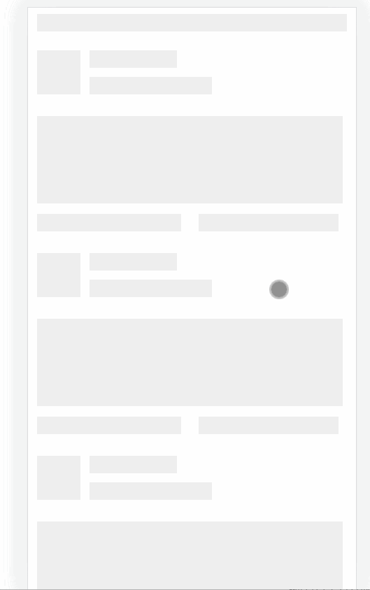

## 1.说明

<!--(补充一下，其实系统中包含了很多细小的bug，这些bug一般在添加新功能的时候我顺手就修复了，但是没有单独的写在文章里，所以要是发现页面效果和之前所说的不一致，那是因为我做了一些微调，改动不会很大，可以自己参考代码进行调整。)-->

体验地址：http://sob.webapp.52android.cn:8001（域名来自a lonely cat）

本节，就是将话题以及摸鱼的数据获取，填充到页面中渲染


## 2.话题数据

话题总共有两个接口，一个是热门话题接口，一个是全部话题接口。两者返回的数据格式是不一致的，但是都是不需要登录就可以获取的。

- 热门话题

  `GET /ct/moyu/topic/index`

  响应如下：

  ```json
  {
      "success": true,
      "code": 10000,
      "message": "获取话题成功.",
      "data": [
          {
              "id": "1384189862646657025",
              "topicName": "代码之美",
              "followCount": 0,
              "contentCount": 0,
              "cover": null,
              "order": 0,
              "description": null,
              "createTime": null,
              "updateTime": null
          }
      ]
  }
  ```

- 全部话题

  `GET /ct/moyu/topic`

  响应如下：

  ```json
  {
      "success": true,
      "code": 10000,
      "message": "获取话题列表成功.",
      "data": [
          {
              "id": "1384518752720130050",
              "topicName": "划水摸鱼",
              "cover": "https://images.sunofbeaches.com/web/2021_04_30/837809810287099904.png",
              "followCount": 0,
              "contentCount": 440,
              "hasFollowed": false,
              "description": "上班时间的额外骚操作"
          }
      ]
  }
  ```


我们选哪个呢？小孩子才做选择，我们全都要。这个为什么全都要呢，主要是热门话题是需要展示在前面的，剩下的才是普通话题。

这里就涉及到一个去重操作，全部话题中必定包含热门话题，但是我们需要的是全部话题的格式，而不要热门话题的格式，所以热门话题接口返回的数据我们取出id之后，就可以抛弃了，接下来对全部话题数据做个不优雅的排序。排序的目的：`根据热门话题的id找出热门话题,然后把这些热门话题移动到前面`。有多种实现方式哈，只要能达成这个目的的都可以，我提供两种思路（两种思路都需要先拿到热门话题的id）：

- 思路1：

  遍历全部话题，加上一个orderNo 属性，只要id是热门话题的id中的一个，就让orderNo大于0。其他普通话题orderNo全是0.

  遍历第一次之后，再进行一次排序，根据orderNo 降序排序，这样得到结果必定是热门话题在前。

- 思路2：

  过滤全部话题，找到其中的热门话题，添加到 hotTopic，其他普通话题，添加到 commonTopic。（到这里经历完一次循环）

  然后把hotTopic和commomTopic 链接起来，让hotTopic在前，可以使用`hotTopic.concat(commonTopic)`。这样hotTopic必定在前面，就实现了热门话题在前的效果。

- 其他思路：

  话题中有个followCount 以及contentCount，如果说热门话题就是根据这两个来来排序的，那么大可只获取全部话题，然后根据这个排序。当然，一般是后端查询时就根据这个排序查好再返回，这里不提

具体代码如下：

```js
   /**
   * 获取动态话题列表
   */
async getMomentTopicList() {
    let allTopicResult = await api.getMoyuAllTopic()
    let hotTopicResult = await api.getMoyuHotTopic()

    let allTopicList = allTopicResult.data

    console.log(hotTopicResult)
    console.log(allTopicResult)

    //从allTopicList中找到hotTopicList的数据
    //为什么要这么做呢，是因为hotTopicList中数据格式和allTopicList中数据格式不一致
    let hotTopicIds = hotTopicResult.data.map(currentValue => currentValue.id)


    //在allTopicList中的hotTopic
    let hotInAll = []

    //去除了hotTopic的剩余topic
    let hotNotInAll = []

    //分类
    allTopicList.forEach(item => {
        if (hotTopicIds.includes(item.id)) {
            hotInAll.push(item)
        } else {
            hotNotInAll.push(item)
        }
    })

    //将hotInAll插入到hotNotInAll前面
    this.categoryList = hotInAll.concat(hotNotInAll)


},
```

我们最后拿到的数据都塞进了categoryList，html只需要拿着这个categoryList去遍历，然后取出里面的每个item的数据即可。

这个函数需要在mounted中被调用。

在遍历的时候注意，有两个话题是不在全部话题里面的，一个叫做 '推荐' 一个叫做`关注`，关注必须登录后才会显示。这两个东西我们就写死成一个html标签即可，后面做切换标签时会说到。


## 3.摸鱼动态数据

接口:`GET `/ct/moyu/list/${topicId}/${page}  

参数：

- topicId ，就是我们前面获取的话题id。推荐对应的id是recommend，关注对应的id是follow
- page 页码，从1开始，用于分页查询。后面的无缝加载就会用到

响应：

```json
{
    "success": true,
    "code": 10000,
    "message": "获取摸鱼列表成功.",
    "data": {
        "list": [
            {
                "id": "1517697955233009665",
                "userId": "1347474750661849088",
                "nickname": "Romantic",
                "avatar": "https://imgs.sunofbeaches.com/group1/M00/00/40/rBsADWAYITCAJpK1AABZPRa3kCo649.png",
                "company": "正在构思中",
                "position": "Bug-ProGrammer",
                "content": "昨天服务器mysql镜像崩溃了，还好我数据备份了，要不然人就完蛋了。",
                "linkCover": null,
                "linkTitle": null,
                "linkUrl": null,
                "commentCount": 1,
                "thumbUpCount": 0,
                "images": [],
                "topicName": "一语惊人",
                "topicId": "1384518439661473794",
                "createTime": "yyyy-MM-dd HH:mm:ss",
                "hasThumbUp": false,
                "thumbUpList": [
                    "1139423796017500160"
                ],
                "vip": true,
            }
            
        ],
        "total": 3179,
        "pageSize": 30,
        "currentPage": 1,
        "hasNext": true,
        "hasPre": false,
        "totalPage": 106
    }
}
```

对响应中部分数据做一个说明:

- company 和 position，就是大家常见的什么岗位，公司数据
- topicName topicId 就是该动态所属的话题的数据，不一定会有
- linkUrl linkCover linkTitle 就是分享的链接数据，不一定会有。其中，linkUrl 是完整的 https://xxx.xxx.xx/xxx 格式，但是我们要展示的数据中，包含一个 链接域名，所以我们到时候需要取出domain域名，也就是去掉http等以及参数等。
- thumbUpList 谁给这条动态点赞了，这里面的就是点赞的人的userid，我们需要通过用户的id和这里面的id对比，如果有，说明当前用户给这条动态点赞了
- commentCount thumbUpCount 就是点赞评论数
- images 就是动态的图片，不一定会有。里面存储的就是图片的地址
- createTime 就是发布时间，我们需要对他进行处理，换成 `xxx小时前` 这种格式

那么具体请求函数如下，代码中进行了详细的注释：

```js
   /**
   * 获取动态列表
   * @param topicId  话题Id，其中推荐为recommend，获取关注的为 follow
   * @param page     为页码，从1开始
   * @param isMerge  合并还是更像数据，用于无缝加载以及下拉刷新
   */
async getMoYuList(topicId = 'recommend', page = 1, isMerge = false) {

	//调用接口获取数据
    let result = await api.getMoyuList(topicId, page)
    let sourceList = result.data.list
    console.log(result)

    //对集合进行处理，比如时间，是否点赞，域名等
    for (let i = 0; i < sourceList.length; i++) {


        let item = sourceList[i]


        //添加本人是否点赞字段，就是判断thumbUpList中是否包含当前用户的id，如果包含，就给此对象添加thumbUpActive属性，根据此属性来决定是否高亮点赞按钮
        item.thumbUpActive = this.idIsContainMe(item.thumbUpList)

        //修改时间，把createTime的时间格式化一下
        item.createTime = this.calcTime(item.createTime)

        //对分享的链接解析出域名
        if (item.linkUrl) {
            //添加了一个属性linkHost
            item.linkHost = this.getDomain(item.linkUrl)
        }
    }

    //是否合并数据
    if (isMerge) {
        this.momentList = this.mergeTargetFromSource(this.momentList, sourceList, 'id')
    } else {
        this.momentList = sourceList
    }


},
```

是否包含当前用户的userid

```js
/**
 * 判断用户id列表中是否包含我的id
 * @param userIdList
 */
idIsContainMe(userIdList) {

    if (!this.$store.state.userInfo) {
        return false
    }

    if (userIdList.includes(this.$store.state.userInfo.id)) {
        return true
    }
    return false
},
```

获取url中的domain

使用这个，需要先安装一个库`npm install parse-domain --save `

然后在页面中导入 `import {parseDomain, fromUrl} from "parse-domain";`

```js
/**
 * 解析url，获取域名
 * @param url
 */
getDomain(url) {
    let parseResult = parseDomain(fromUrl(url));
    return parseResult.hostname
},
```

calcTime以及mergeTargetFromSource，这两个函数使用地方比较多，因此我们把他们加入到全局函数中，也就是插件moreFunction.js

```js
/**
 * 把sourceArr中包含的targetArr中的数据除去,然后合并
 * 前提条件：数组中对象必须是同一个格式
 * @param targetArr 旧数组
 * @param sourceArr 新获得的数组，里面包含旧数组的部分值
 * @param uniqueKey 唯一键
 */
Vue.prototype.mergeTargetFromSource = function (targetArr,sourceArr,uniqueKey) {

    //数组不能为空，唯一键也不能为空
    if (!targetArr||targetArr.length===0
        ||!sourceArr||sourceArr.length===0
        || !uniqueKey
    ){
        return []
    }

    let obj = {}
    for (let i = 0; i < targetArr.length; i++) {
        obj[ targetArr[i][uniqueKey] ] = targetArr[i]
    }
    for (let i = 0; i < sourceArr.length; i++) {
        //如果拿着你的id去 obj 里找，找不到，说明原本的 this.recommendArticleList没有这个对象

        if (!obj[sourceArr[i][uniqueKey]]) {
            targetArr.push(sourceArr[i])
        }
    }

    return targetArr

}

/**
 * 将YYYY-MM-DD HH:mm 格式的时间格式化，并计算距离现在有多久
 * @param timeStr
 * @returns {string|*}
 */
Vue.prototype.calcTime= function(timeStr) {
    let formatResult = moment(timeStr, "YYYY-MM-DD HH:mm").fromNow()
    if (formatResult=='Invalid date'){
        return timeStr
    }else {
        return formatResult
    }
}
```

到这里，动态的数据就全部存储到momentList中了。到页面上把数据取出来，渲染到其中即可，没什么复杂的地方，我就不细说了。

## 4.切换话题并更新摸鱼动态

切换话题，本质上是把currentTagId换成你点击的话题的id，刷新数据就是拿着这个currentTagId 去重新调用摸鱼动态接口。

逻辑理清之后开始实现，怎么知道点击哪个话题？在话题的html标签上加上点击事件，点击之后就能拿到这个话题的id以及index，index决定了是否高亮，所以也是需要的。

```html
 <div slot="list" class="tagItem nut-hor-list-item "
                     ......
                     :class="{tagCurrent: currentTag==index}"
                     v-for="(item,index) in categoryList" :key="item.id"
                     @click="changeTag(index,item)"
                >
     ......
</div>
```

上面展示的是正常的话题，对于关注、推荐这两个不存在于接口中的话题，我们需要写死。把他们的tagIndex写死，tagId也写死，然后点击去调用changeTag函数传递参数即可。

```html
<div slot="list" class="tagItem nut-hor-list-item " :class="{tagCurrent: currentTag==-1}"
     @click="changeTag(-1,'recommend')"  
>
    <span class="tagTitle">推荐</span>
</div>

<div slot="list" class="tagItem nut-hor-list-item "
     v-if="$store.state.userInfo"
     :class="{tagCurrent: currentTag==-2}"
     @click="changeTag(-2,'follow')"
>
    <span class="tagTitle">关注</span>
</div>
```


然后就是对应的加载数据的函数。点击之后，触发changeTag函数，把id和index更新，然后调用摸鱼动态数据更新接口

```js
/**
 * 切换标签页的回调
 * @param tagIndex
 */
changeTag(tagIndex, tagId) {
    this.currentTag = tagIndex
    this.currentTagId = tagId
    //页码肯定是第一页，因为你是切换到新话题。数据当然也是不需要合并的
    this.getMoYuList(this.currentTagId, 1, false)
},
```

这样就完成了话题的切换。


## 5.下拉刷新以及上拉加载

和首页一样，nut-scroller有两个回调

```html
@loadMore="loadMoreVert"
@pulldown="pulldown"
```

只需要在这两个函数中发起请求，并重新获取数据即可。

这里需要注意，我们下拉刷新，或者上拉加载时，有两个要求：

- 展示加载提示
- 禁止用户快速多次的下拉

这两个要求可以结合到一起做。nut-scroller组件自带了两个属性

```html
:is-un-more="isUnMore"
:is-loading="isLoading"
```

是用来控制是否正在加载的，当isLoading是true时，组件会弹出提示，此时即使多次下拉也不会触发pulldown函数。这就达成了上面的两个要求。

所以，当下拉时，我们先把isLoading设置为true，然后发起数据，当数据加载完成，再把isLoading设置为false。上拉时同理，把isUnMore给设置为true，等加载完毕再关闭。

咱们之前在这里设置了个函数节流（首页），实际没有必要，组件自带了。咱们直接去掉就行。把isLoading设置为false这个操作，需要在加载完毕摸鱼数据后才做，所以放到getMoYuList函数中。

另外呢，因为摸鱼动态接口获取第二页的数据花费的时间是6秒，比较长，所以在上拉无缝加载时，我们自己再额外弹出一个提示，等加载完毕再关闭，


```js
//开启使用的是：（注意，存储了返回的toast对象）
this.toast = this.$toast.loading('加载中...', {
    duration: 0,
    id: 'momentLoading'
});

//关闭使用的是
this.toast.hide();
```

那么总体 下拉刷新，上拉加载，以及摸鱼数据获取的函数就是这样：

```js
/**
 * 获取动态列表
 * @param topicId  话题Id，其中推荐为recommend，获取关注的为 follow
 * @param page     为页码，从1开始
 * @param isMerge  合并还是更像数据，用于无缝加载以及下拉刷新
 */
async getMoYuList(topicId = 'recommend', page = 1, isMerge = false) {


    let result = await api.getMoyuList(topicId, page)
    let sourceList = result.data.list


    //对集合进行处理，比如时间，是否点赞，域名等
    for (let i = 0; i < sourceList.length; i++) {


        let item = sourceList[i]


        //屏蔽部分用户
        if (item.userId==='1256120724666454016'){
            sourceList.splice(i,1)
            continue
        }

        //添加本人是否点赞字段
        item.thumbUpActive = this.idIsContainMe(item.thumbUpList)

        //修改时间
        item.createTime = this.calcTime(item.createTime)

        //对分享的链接解析出域名
        if (item.linkUrl) {
            item.linkHost = this.getDomain(item.linkUrl)
        }
    }

    if (isMerge) {
        this.momentList = this.mergeTargetFromSource(this.momentList, sourceList, 'id')
    } else {
        this.momentList = sourceList
    }

   
    this.isUnMore = false
    this.isLoading = false
    //需要判断，因为getMoYuList被切换话题调用时，是没有这个loading提示的
    if (this.toast.hide) {

        this.$nextTick(() => {
            this.toast.hide();
        })
    }

},


/**
 * 上拉加载更多
 */
loadMoreVert() {
    this.isUnMore = true
    this.getMoYuList(this.currentTagId, ++this.currentPage, true)

    this.toast = this.$toast.loading('加载中...', {
        duration: 0,
        id: 'momentLoading'
    });

},

/**
 * 下拉刷新
 */
pulldown() {
   
    this.isLoading = true
    this.getMoYuList(this.currentTagId, 1, false)

},
```

getMoYuList最显著的变化就是在加载完毕后修改了几个flag来关闭提示。

## 6.骨架屏以及对应的动画

骨架屏还是和首页差不多，就几个矩形，用一个flag来控制是否显示，当摸鱼数据获取完毕之后就把isSkeletonLoading设置为false关闭骨架屏。

但是这次的区别是，加上了动画。之前的骨架屏就是静态的，这次我们加上动画，会有一闪一闪的效果

这个怎么实现呢？在骨架屏旁边，同级加上一个div，加个class，样式如下：

```css
/*---------------骨架屏 ---------------*/
.vue-skeleton-loading {
    position: fixed;
    top: 5px; /*这部分可以微调*/
    right: 0;
    bottom: 0;
    left: -10px;
    z-index: 9998;
    font-size: 12px;
    background: #fff;
}
.vue-skeleton-loading .skeleton-bac-animation {
    position: absolute;
    z-index: auto;
    width: 100%;
    height: 100%;
    background: -webkit-gradient(linear,left top,right top,from(hsla(0,0%,100%,0)),color-stop(50%,hsla(0,0%,100%,.5)),color-stop(80%,hsla(0,0%,100%,0)));
    background: -o-linear-gradient(left,hsla(0,0%,100%,0),hsla(0,0%,100%,.5) 50%,hsla(0,0%,100%,0) 80%);
    background: linear-gradient(90deg,hsla(0,0%,100%,0),hsla(0,0%,100%,.5) 50%,hsla(0,0%,100%,0) 80%);
    background-size: 30% 100%;
    background-repeat: no-repeat;
    -webkit-animation: backpos .9s ease-in-out 0s infinite;
    animation: backpos .9s ease-in-out 0s infinite;
}
```

结构如下：

```html
<!--骨架屏-->
<div v-if="isSkeletonLoading" class="vue-skeleton-loading">
   <div class="skeleton-bac-animation"></div>
   <div>
       <row padding="2px 20px 2px">
           <skeleton-square
                   width="355px"
                   height="20px"
           ></skeleton-square>

       </row>

       <row slot="list" padding="15px 20px 0">

           <skeleton-square
                   width="50px"
                   height="50px"
           >
           </skeleton-square>

           <column>
               <skeleton-square
                       width="100px"
                       :count="1"
                       margin="5px 10px 5px"
                       height="20px"
               ></skeleton-square>
               <skeleton-square
                       width="140px"
                       :count="1"
                       margin="5px 10px 5px"
                       height="20px"
               ></skeleton-square>
           </column>

       </row>

       <row slot="list" padding="15px 10px 0">


           <skeleton-square
                   width="350px"
                   :count="1"
                   margin="5px 10px 5px"
                   height="100px"
           ></skeleton-square>

       </row>

       <row slot="list" padding="2px 10px 0">


           <skeleton-square
                   width="165px"
                   :count="1"
                   margin="5px 10px 5px"
                   height="20px"
           ></skeleton-square>
           <skeleton-square
                   width="160px"
                   :count="1"
                   margin="5px 10px 5px"
                   height="20px"
           ></skeleton-square>
       </row>

       <row slot="list" padding="15px 20px 0">

           <skeleton-square
                   width="50px"
                   height="50px"
           >
           </skeleton-square>

           <column>
               <skeleton-square
                       width="100px"
                       :count="1"
                       margin="5px 10px 5px"
                       height="20px"
               ></skeleton-square>
               <skeleton-square
                       width="140px"
                       :count="1"
                       margin="5px 10px 5px"
                       height="20px"
               ></skeleton-square>
           </column>

       </row>

       <row slot="list" padding="15px 10px 0">


           <skeleton-square
                   width="350px"
                   :count="1"
                   margin="5px 10px 5px"
                   height="100px"
           ></skeleton-square>

       </row>

       <row slot="list" padding="2px 10px 0">


           <skeleton-square
                   width="165px"
                   :count="1"
                   margin="5px 10px 5px"
                   height="20px"
           ></skeleton-square>
           <skeleton-square
                   width="160px"
                   :count="1"
                   margin="5px 10px 5px"
                   height="20px"
           ></skeleton-square>
       </row>

       <row slot="list" padding="15px 20px 0">

           <skeleton-square
                   width="50px"
                   height="50px"
           >
           </skeleton-square>

           <column>
               <skeleton-square
                       width="100px"
                       :count="1"
                       margin="5px 10px 5px"
                       height="20px"
               ></skeleton-square>
               <skeleton-square
                       width="140px"
                       :count="1"
                       margin="5px 10px 5px"
                       height="20px"
               ></skeleton-square>
           </column>

       </row>

       <row slot="list" padding="15px 10px 0">


           <skeleton-square
                   width="350px"
                   :count="1"
                   margin="5px 10px 5px"
                   height="100px"
           ></skeleton-square>

       </row>

       <row slot="list" padding="2px 10px 0">


           <skeleton-square
                   width="165px"
                   :count="1"
                   margin="5px 10px 5px"
                   height="20px"
           ></skeleton-square>
           <skeleton-square
                   width="160px"
                   :count="1"
                   margin="5px 10px 5px"
                   height="20px"
           ></skeleton-square>
       </row>
   </div>


</div>
```

因为骨架屏在首页，文章详情页面也用到了，这个动画就一起多个页面给更新掉。

## 7.源码

https://github.com/cctyl/sunofbeach_mobile