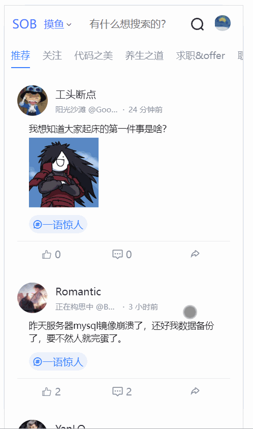
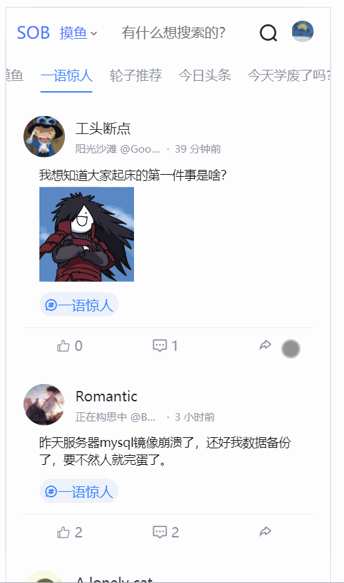

## 1.说明

<!--(补充一下，其实系统中包含了很多细小的bug，这些bug一般在添加新功能的时候我顺手就修复了，但是没有单独的写在文章里，所以要是发现页面效果和之前所说的不一致，那是因为我做了一些微调，改动不会很大，可以自己参考代码进行调整。)-->

体验地址：http://sob.webapp.52android.cn:8001（域名来自a lonely cat）

本节主要进行一些bug的修复以及摸鱼动态页面新功能：点击该动态的话题跳转到指定话题页面

## 2.bug修复

- 登录后右上角消息列表打不开

  这个其实是，登录之后要显示msgBox，会读取msgData。但是登录完毕之后，没有去调用消息获取接口，所以读取的是undefined，所以打不开。

  那么我们就需要在登录后，重新调用一下这个消息获取接口。

  怎么做呢？我们登录之后，vuex中的userInfo就会被赋值。我们可以监听这个变量，只要发生改变，并且有值，说明是登录了，这时候重新发起请求。在Header.vue加上这段监听代码：

  ```js
  watch: {
      userInfo() {
          //用户信息发送变化
          if (this.userInfo) {
              //重新获取消息
              this.getMsgCount()
          }
      },
  },
  ```

  这样就解决了


## 3.点击话题跳转页面

先看效果：

 

我们点击动态的话题，首先是话题容器进行了滚动，然后摸鱼数据进行了更新，并且回到了顶部。

话题容器怎么滚动呢？我们的话题是通过nut-scroller来展示的。它里面有个属性：`:scrollTo="tagScrollY"`

只要我们改变tagScrollY这个的值，就可以让他滚动到指定的位置，摸鱼动态回到顶部也是同理。

那么怎么知道要滚动到哪个位置呢？首先我们要找到这个话题，在话题容器中对应的html标签。找到他，拿到他相对于屏幕左边的距离，这个就是要滚动的距离。

我们手先给动态中的蓝色话题标签添加点击事件：

```html
<div class="topic" v-if="item.topicName" @click="clickToTopic(item.topicId)" >
    <i class="iconfont icon-topic">{{item.topicName}}</i>
</div>
```

注意看哈，我们传递的是topicId，这里也只能拿到topicId。然后我们就需要通过这个topicId，去找到这个dom元素。

怎么找这个dom元素呢，我们在遍历时，给每个tag元素都加上ref，相当于id。这个id的格式就是 tagScroll+index。是有规律的。

```html
<div slot="list" class="tagItem nut-hor-list-item "
     :ref="'tagScroll'+index" <!--注意看这里-->
     v-for="(item,index) in categoryList" :key="item.id"
     @click="changeTag(index,item.id)"
>
    <span class="tagTitle">{{item.topicName}}</span>
</div>
```

只要，我们知道这个tagItem的index，就能知道它的ref，就可以找到这dom元素。

那么怎么通过topicId去找到这个index? 这个话题列表是遍历categoryList实现的，我们直接拿着这个topicId去categoryList找，找到这个元素，拿到他的index，就得到了他的ref。

找到这个dom之后，我们通过 `ele.getBoundingClientRect().left` 就可以拿到他的位置，这样就可以让他滚动起来了。

最后是更新数据，一般我们点击一下顶部话题列表，就会触发事件changTag，就会去更新数据。现在我们直接拿到了这个元素，直接通过代码来触发click事件即可。

代码如下：

```js
/**
 * 点击话题，跳转到该话题的标签下
 * @param topicId
 */
clickToTopic(topicId){

    //找到话题

    let topicIndex = 0
    let topicItem = this.categoryList.filter((value,index) => {
        if (value.id===topicId){

            topicIndex = index
            return true
        }else {
            return false
        }
    })

    if (topicItem.length>0){

        //拿到这个话题对应的tag元素
        let clickTagItem= this.$refs['tagScroll' + topicIndex][0]

        //触发他的点击事件
        clickTagItem.click()

        //拿到该tag距离页面左边的位置，滚动到该标签所在的位置
        // +40是为了让标签稍微偏中间
        this.tagScrollY = -clickTagItem.getBoundingClientRect().left+40

        //同时，让竖直方向的页面也滚动回顶部
        if (this.momentListScrollY===-1){
            this.momentListScrollY = this.momentListScrollY+0.1
        }else {
            this.momentListScrollY =-1
        }

    }

},
```


## 4.动态页大图展示

前面我们已经可以把图片展示到页面上了。但是非常的小，不方便查看，我们需要添加一个查看大图的功能。

效果如下：

 

就是点击图片，可以放大查看。

这里我们用到一个插件：

安装：`npm install vue-image-touch --save`

到main.js中注册：

```js
//图片预览插件
import VueImageTouch from 'vue-image-touch';
Vue.use(VueImageTouch);


new Vue({
   ......
}).$mount('#app') 
```


然后给图片的html标签添加点击事件： showBigImg

```js
<div
        @click="showBigImg(item.images,index)"
        v-for="(img,index) in item.images" :key="img"
        class="bg-img"
        v-bind:style="{backgroundImage:`url('${img}')`}">
</div>
```

对应回调如下：

```js
 /**
 * 查看大图
 * @param images 图片url数组
 * @param index  点击的图片在数组中的下标
 * 
 */
showBigImg(images, index) {
    this.$imageTouch(
        {
            imageList: images, // 图片数组
            activedIndex: index, // 进度下标
            isShowBar: true,   // 是否显示进度
        }
    );
},
```

这样就可以实现啦


## 源码

参考https://github.com/cctyl/sunofbeach_mobile 

