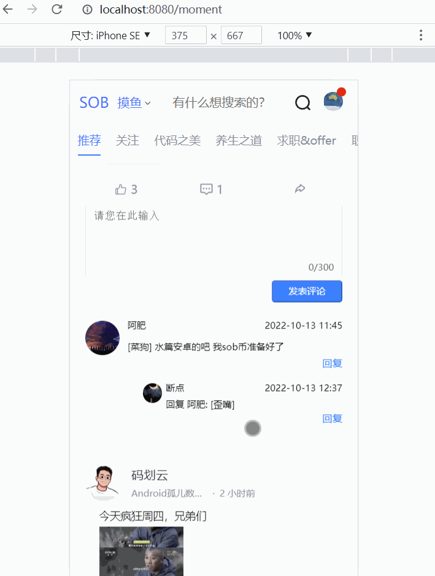

## 1.说明

体验地址：http://sob.webapp.52android.cn:8001（域名来自a lonely cat）

这次间隔了约6个月，没有写过前端代码了。这段时间相对比较忙了，没法摸鱼。并且也是专职后端了。css布局等知识都忘得差不多了，磕磕盼盼的续上了这部分代码。

本次主要阐述评论列表展示的编写，给vm._data 中对象新增属性、以及nginx部署刷新404问题的解决。


## 2.数据获取

都这么多期了我就直接说了。

接口地址：

```js
GET {baseUrl}/ct/moyu/comment/${momentId}/${page}?sort=0
```

momentId就是摸鱼id。page就是分页。目前来说，1页应该能放下所有评论，康师傅没说一页多少条，暂时写成第一页。

数据获取方法：

```js
   /**
     * 获取摸鱼评论列表
     * @param momentId
     * @returns {Promise<unknown>}
     */
    getMoyuCommontList(momentId,page=1) {
        return ajax(`/ct/moyu/comment/${momentId}/${page}?sort=0`)
    },
```

页面上调用接口，并存储数据

```js
 /**
             * 获取动态的评论信息
             * @param momentItem
             * @returns {Promise<void>}
             */
            async getMomentCommontList(momentItem){
                let result = await api.getMoyuCommontList(momentItem.id)
                //添加一些属性
                for (let i = 0; i < result.data.list.length; i++) {
                    //showMore
                    result.data.list[i].showMore = false;
                }
                Vue.set(momentItem,'commentList', result.data.list)
            },
```

这里务必注意。我们把评论列表，塞到了摸鱼动态对象上。我们不能直接给momentItem设置值，这样设置的数据是放在vm._data 中，不会被vue监听到。必须使用 Vue.set() 这样数据更新后页面才会变化。

另外可以看到，我给每个评论对象，加上了showMore属性，这是为了给页面上加上控制是否展示多条评论的开关。一定要在设置到momentItem之前，赋予属性。如果已经塞进去之后再设置，此时可能会遇到上面所说的无法监听的问题。


## 3.页面结构

页面结构我们大部分复用了 文章详情页面的结构。因为两者从数据结构上也是接近一致的。

结构直接展示如下：

```html
<!--评论列表-->
<div v-if="item.showCommont" class="reviewList" >
    <div class="commentInput">
        <!--评论填写框-->
        <nut-textbox
                class="inputBox"
                v-model="item.commentStr"
                :max-num="300"
                :txt-area-h="80"
        ></nut-textbox>
        <button  disabled="disabled" class="submit-btn">发表评论</button>
    </div>
    <div class="reviewItem" v-for="currentComment in item.commentList" :key="currentComment.id">
        <!--评论人头像-->
        <div class="left">
            
        </div>

        <div class="reviewRight">
            <!--评论人信息，点赞-->
            <div class="top">
                <span class="reviewNikename">{{currentComment.nickname}}</span>
                <span >{{currentComment.createTime}}</span>
            </div>
            <!--评论内容-->
            <div class="reviewBottom">{{currentComment.content}}</div>

            <!--回复评论的按钮-->
            <div class="comment-btn">
               <!--
               todo
               <span
                    @click="openCommentPanel(true,item)"
                 >回复</span>-->
                <span>回复</span>
            </div>

            <!--下面的子评论-->
            <!--只有一条回复就直接展示-->
            <div class="subcommentBox" v-if="currentComment.subComments.length===1">
                <div class="subcomment">
                    <!--评论人头像-->
                    <div class="subleft">
                        
                    </div>

                    <div class="subreviewRight">
                        <!--评论人信息，点赞-->
                        <div class="subtop">
                            <span class="subreviewNikename">{{currentComment.subComments[0].nickname}}</span>
                            <span >{{currentComment.subComments[0].createTime}}</span>
                        </div>
                        <!--评论内容-->
                        <p class="subreviewBottom">
                            {{currentComment.subComments[0].nickname? '回复 '+currentComment.nickname+':':'' }}
                            {{currentComment.subComments[0].content}}
                        </p>
                        <!--回复评论的按钮-->
                        <div class="comment-btn">
                            <!--todo-->
                            <!--<span @click="openCommentPanel(true,item.subComments[0])">回复</span>-->
                            <span>回复</span>
                        </div>
                    </div>
                </div>

            </div>

            <!--有一条以上，但是没有做展开，就只显示一条，并添加展开按钮-->
            <div class="subcommentBox" v-if="currentComment.subComments.length>1 && !currentComment.showMore">
                <div class="subcomment">
                    <!--评论人头像-->
                    <div class="subleft">
                        
                    </div>

                    <div class="subreviewRight">
                        <!--评论人信息，点赞-->
                        <div class="subtop">
                            <span class="subreviewNikename">{{currentComment.subComments[0].nickname}}</span>
                            <span >{{currentComment.subComments[0].createTime}}</span>
                        </div>
                        <!--评论内容-->
                        <p class="subreviewBottom">
                            {{currentComment.subComments[0].nickname? '回复 '+currentComment.subComments[0].nickname+':':'' }}
                            {{currentComment.subComments[0].content}}
                        </p>
                        <!--回复评论的按钮-->
                        <div class="comment-btn">
                            <!--todo-->
                            <!--<span @click="openCommentPanel(true,item.subComments[0])">回复</span>-->
                            <span>回复</span>
                        </div>
                    </div>
                </div>
                <!--这里直接就给当前评论加上一个showMore属性，用来标记是否展示更多评论-->
                <span class="sub-see-more" @click="currentComment.showMore=true">点击查看更多({{currentComment.subComments.length-1}})</span>
            </div>

            <!--有一条以上，并点击了展开按钮，就显示全部-->
            <div class="subcommentBox" v-if="currentComment.subComments.length>1 && currentComment.showMore">
                <div class="subcomment" v-for="subitem in currentComment.subComments" :key="subitem.id">
                    <!--评论人头像-->
                    <div class="subleft">
                        
                    </div>

                    <div class="subreviewRight">
                        <!--评论人信息，点赞-->
                        <div class="subtop">
                            <span class="subreviewNikename">{{subitem.nickname}}</span>
                            <span >{{subitem.createTime}}</span>
                        </div>
                        <!--评论内容-->
                        <p class="subreviewBottom">
                            {{subitem.nickname? '回复 '+subitem.nickname+':':'' }}
                            {{subitem.content}}
                        </p>
                        <!--回复评论的按钮-->
                        <div class="comment-btn">
                            <span  >回复</span>
                        </div>
                    </div>


                </div>
                <!--这里直接就给当前评论加上一个showMore属性，用来标记是否展示更多评论-->
                <span class="sub-see-more" @click="currentComment.showMore=false">收起</span>

            </div>
        </div>
    </div>

    <div class="reviewItem" v-show="item.commentList&&item.commentList.length==0">
        <div class="noComment ">
            <i class="iconfont icon-meiyoushuju"></i>  暂无评论~~
        </div>
    </div>
</div>
```

接下来，要控制这个评论列表的展开和关闭。此时遇到个问题，每个动态都有自己的评论列表，那么我如果只声明一个flag属性去控制，那么具体控制的是哪一条摸鱼动态的评论列表呢？

所以，这个控制评论列表展示的开关，应当与摸鱼动态对象直接关联。因此我们就直接把这个开关放到摸鱼动态对象身上。

在评论按钮上加上一个点击事件：

```html
  <i class="action-btn iconfont icon-pinglunxiao" @click="openCommontList(item)">
                                    <span style="padding: 0px 5px">{{item.commentCount}}</span>
                                </i>
```

点击时，把当前的摸鱼对象传递给openCommontList方法。

对于openCommontList方法，需要做两件事。

- 控制评论列表的开启/关闭
- 获取评论数据

根据前面所说，我们需要给这个摸鱼对象上加上一个开关`showCommont`。当`showCommont=true`则表示开启评论列表，为false则关闭。每次点击进行取反。

此时同样的，我们额外的给摸鱼对象设置了属性，那么就需要用到Vue.set 方法。否则我们创建的属性不会被vue给监听到。

具体代码如下：

```js
    /**
             * 打开评论列表
             * @param momentItem
             */
            openCommontList(momentItem){
                if (momentItem.showCommont == true){
                    //注意，必须这么设置才能被vue监听到
                    Vue.set(momentItem,'showCommont',false)
                }else {
                    Vue.set(momentItem,'showCommont',true)
                    this.getMomentCommontList(momentItem);
                }
            }
```


## 4.nginx 部署404问题

在今天之前，sob_webapp 访问后，只要一刷新，就会报404。比如首页`http://sob.webapp.52android.cn:8001/home`。

因为nginx之前配置的时候location /{} 会到目录下找对应的文件。但是 `/home` 实际不是一个文件。现在vue是单页面应用了。只有一个index.html。所以当找不到文件的时候，应该去访问index.html。

最后修改nginx server块配置如下：

```js
 server {
        listen       80;
        server_name  localhost;

        #charset koi8-r;

        #access_log  logs/host.access.log  main;

        location / {
			# 省略其他......
			try_files $uri $uri/ /index.html; 
		}
}
```


## 5.效果展示


