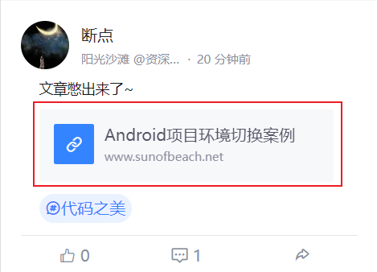
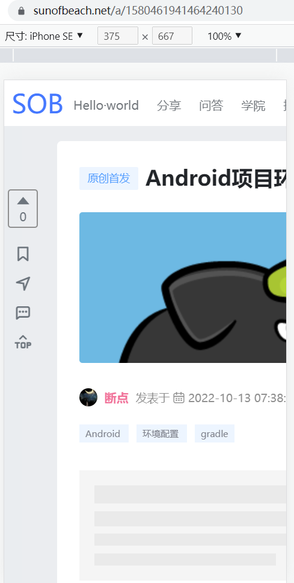

## 1.说明

体验地址：http://sob.webapp.52android.cn:8001（域名来自a lonely cat）

源码地址：https://github.com/cctyl/sunofbeach_mobile


## 2.站内文章跳转

当用户分享了一篇主站文章的链接时，例如：

 

可以看到，他的域名是www的主站地址。此时点击打开，就会在手机端访问主站地址。格式相当的不友好。

 

此时我们希望，如果这个链接是站内文章，那么直接跳转到我们手机端的文章详情页面，实现站内跳转。这样一来文章格式以及阅读体验都会比较好。

找到链接对应的a标签，我们给他加上点击事件。

```html
 <a @click="toArticlePage(item.linkUrl)"></a>
```

对应toArticlePage方法，应当做到这些功能：

- 判断当前链接是否是站内文章链接
- 如果是，进行站内跳转
- 如果不是，那么接着在当前窗口打开

代码比较简单，如下所示：

```js
/**
             * 打开分享的链接
             * @param url
             */
            toArticlePage(url){
                //如果是主站的文章链接，则跳转到手机端页面查看
                //https://www.sunofbeach.net/a/1580461941464240130
                if (url.includes("www.sunofbeach.net/a")){
                    let articleId = url.substr(url.indexOf("/a/")+3,url.length-1)
                    this.$router.push({
                        path: '/detail',
                        query: {id: articleId}
                    })
                }else {
                    console.log("其他链接")
                    window.location.href=url
                }
            }
```

