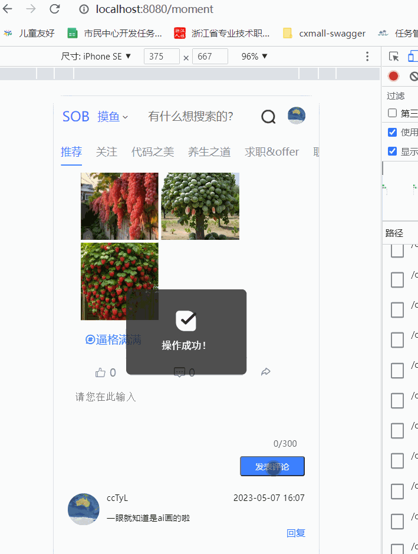
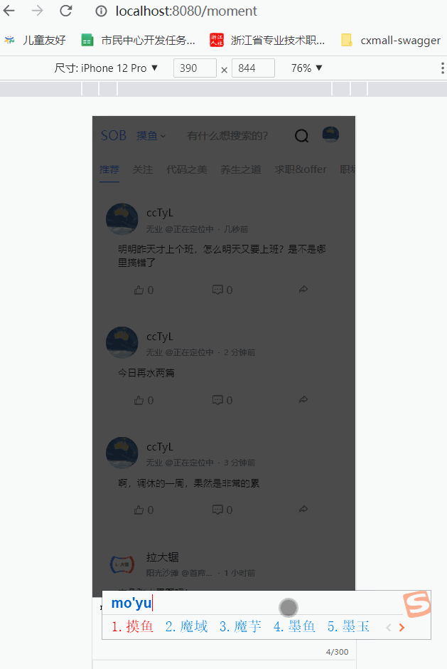
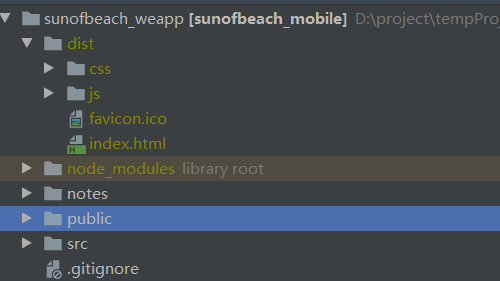

# 完结篇：发送摸鱼动态、动态评论以及评论回复的实现

### 简介

源码地址：https://github.com/cctyl/sunofbeach_mobile

之前已经完成评论输入框，以及输入按钮的界面实现。现在我们要对其功能进行实现。

这里评论分两个部分

- 一、评论摸鱼动态
- 二、回复摸鱼动态评论的评论


### 评论摸鱼动态

看下效果：



当我们点击回复按钮时，展开评论列表以及输入框。输入内容后直接调用接口就可以啦，是不是非常简单。

点一下就发送，发送完清空输入框，然后弹出一个提示，最后更新摸鱼动态列表。

其实这种更新做法不太优雅，应该是把我们新增的评论自己push到列表中，但是因为我们无法获得评论id，后续会出现问题，所以直接更新了整个列表。

另外，评论按钮上面的数字也要同步更新（上方的截图漏了）

代码如下：

```js
//接口部分
   /**
     * 评论摸鱼动态
     * POST /ct/moyu/comment
     * comment: {
          momentId: '',
          content: ''
        }
     */
    sendMoyuComment(momentId,content){
        return ajax(`/ct/moyu/comment`, {
            momentId,
            content
        }, 'POST')
    }


//发送逻辑
           /**
             * 发表评论
             * @param commentStr
             */
            async sendMoyuComment(momentItem) {
                console.log("当前的评论内容是：")
                console.log(momentItem)
                let result = await api.sendMoyuComment(momentItem.id, momentItem.commentStr);
                if (result.success) {
                    this.$toast.success('操作成功！');
                    momentItem.commentStr = ''
                    //需要更新回复列表
                    this.getMomentCommontList(momentItem);
                } else {
                    this.$toast.fail('发送失败！' + result.message);
                }
            },

```


### 回复摸鱼动态评论的评论

稍微还是有一点复杂的

效果如下：


逻辑是这样的，我们挪用了文章评论里的组件，偷懒使用弹出层进行评论，点击评论后展开弹出一个弹出层，注意弹出层中包含一个被回复的用户名。点击评论后，关闭弹出层，清空输入框，刷新评论列表。

这里稍微有一点复杂，我们拿一个案例来解释。


这个摸鱼动态的评论的数据结构是：

```js
{
    content:"刚刚更新了一下博客...",
    commentItemList:[
        {
            content:"版本差异挺大的....",
            subItem:[
                {
                    content:"回复拉大锯 我一直用"
                },
                {
                    content:"回复 断点 你没有使用新的库"
                }
            ]
        }
    ]
}
```

最外层的是一个MoyuMoment 对象，而内层开始就是一级评论对象。一级评论对象中，有两个子评论对象。总共有三层。

回到图上，图上有三个回复按钮，你觉得他们分别回复的是 一级评论对象，还是子评论对象，还是MoyuMoment 对象？

实际上，这三个按钮回复的都是 一级评论对象，“版本差异挺大的”。 

也就是说，虽然下面的两个子评论，看起来是回复关系，实际上是平级关系。

现在我们知道了它的层级结构之后，到时候取commentId 时，就千万不要取错了。取错之后，虽然后端依然会返回评论成功，但是实际上还是评论失败的。

代码大概的贴一下：

```html
 <!--弹出层-评论框-->
            <nut-popup
                    position="top"
                    v-model="showCommentPanel"
            >

                <!--评论填写框-->
                <nut-textbox
                        class="comment-input"
                        v-model="popCommentStr"
                        :place-text="commentPlaceText"
                        :max-num="300"
                        :txt-area-h="80"
                ></nut-textbox>
                <nut-button
                        type="light"
                        @click="submitComment"
                        block
                >
                    提交
                </nut-button>

            </nut-popup>
```


```js
//api
    /**
     * 回复评论
     * @param content
     * @param momentId
     * @param targetUserId
     * @param commentId
     * @returns {Promise<unknown>}
     */
    sendMoyuSubComment(
                   content,
                   momentId,
                   targetUserId,
                   commentId
               ) {

        return ajax(`/ct/moyu/sub-comment`, {
            content,
            momentId,
            targetUserId,
            commentId

        }, 'POST')
    },

        

//data部分新增变量
         		showCommentPanel:false,//是否展示评论弹窗
                popCommentStr:'',//弹出回复框数据绑定
                popCommentType:0,//评论类型，是一级评论，还是子评论
                popCommentObj:{},//当前将要回复的评论对象
                popCommentTargetUserId:0,//将要回复的用户id
                commentMomentItem:{},//当前正在被评论的摸鱼动态对象
//摸鱼逻辑：
      		/**
             * 发表评论
             * @param commentStr
             */
            async sendMoyuComment(momentItem) {
                console.log("当前的评论内容是：")
                console.log(momentItem)
                let result = await api.sendMoyuComment(momentItem.id, momentItem.commentStr);
                if (result.success) {
                    this.$toast.success('操作成功！');
                    momentItem.commentStr = ''
                    //需要更新回复列表
                    this.getMomentCommontList(momentItem);
                } else {
                    this.$toast.fail('发送失败！' + result.message);
                }
            },

            /**
             * 展示评论填写框
             */
            openCommentPanel(commentObj,type,targetUserId,targetUserName,momentItem){
                this.commentPlaceText = '说说你的想法吧'
                //清空旧数据
                this.popCommentStr = ""
                //打开弹出层
                this.showCommentPanel = true
                this.popCommentTargetUserId = targetUserId
                this.commentMomentItem = momentItem
                this.popCommentObj = commentObj;
                if (!this.isLogin()) {
                    return
                }

                /**
                 * 4 一级评论
                 *
                 */
                this.popCommentType = type
                this.commentPlaceText=`回复 @${targetUserName}`
            },
            /**
             * 发送摸鱼评论
             */
           async sendMoyuComent(){
                let result = await api.sendMoyuSubComment(
                    this.popCommentStr,
                    this.popCommentObj.momentId,
                    this.popCommentTargetUserId,
                    this.popCommentObj.id
                )

                if (result.code === 10000) {
                    this.$notify.success(result.message)

                    //更新评论列表
                    this.getMomentCommontList(this.commentMomentItem);
                } else {
                    this.$notify.warn(result.message)
                }
            },
            
            /**
             * 提交评论
             */
            handlePopSubmit() {
                if (this.popCommentType===5){
                    //偷懒，使用评论的弹出层
                    this.sendMoyu();
                }else {
                    this.sendMoyuComent();
                }

                //清空评论框
                this.popCommentStr = ''
                //关闭弹窗
                this.showCommentPanel = false
                this.popCommentObj={}

            },

```


### 发送摸鱼动态

你会发现我是倒过来做的。先做了摸鱼的评论再做了摸鱼的发布

效果图：



由于今天发了很多摸鱼，所以这里没有点提交。

实现逻辑上，我是直接复用了摸鱼评论的pop框，所以代码几乎一致，不同就是在右下角增加了一个触发按钮：

```html
   <!--发布摸鱼按钮-->
<div class="moyu-send-btn" @click="openMoyuPanel">
        <i class="action-btn iconfont icon-jiahao" ></i>
</div>
 .moyu-send-btn{
        position: fixed;
        right: 7%;
        bottom: 5%;
        width: 50px;
        height: 50px;
        z-index: 1000;
        cursor: pointer;
    }

    .moyu-send-btn .action-btn{
        font-size: 45px;
        color: #fb6064;
    }
```

简单的贴一下js部分：

```js
//api    
/**
     * 发表动态
     * @param content
     * @param topicId
     * @param images
     * @returns {Promise<unknown>}
     */
    publishMoyu(
                    content,
                    topicId,
                    images
                ) {
        return ajax(`/ct/moyu`, {
            content,
            topicId,
            images
        }, 'POST')
    },
//逻辑
  /**
             * 发表评论
             * @param commentStr
             */
            async sendMoyuComment(momentItem) {
                console.log("当前的评论内容是：")
                console.log(momentItem)
                let result = await api.sendMoyuComment(momentItem.id, momentItem.commentStr);
                if (result.success) {
                    this.$toast.success('操作成功！');
                    momentItem.commentStr = ''
                    //需要更新回复列表
                    this.getMomentCommontList(momentItem);
                } else {
                    this.$toast.fail('发送失败！' + result.message);
                }
            },

            /**
             * 展示评论填写框
             */
            openCommentPanel(commentObj,type,targetUserId,targetUserName,momentItem){
                this.commentPlaceText = '说说你的想法吧'
                //清空旧数据
                this.popCommentStr = ""
                //打开弹出层
                this.showCommentPanel = true
                this.popCommentTargetUserId = targetUserId
                this.commentMomentItem = momentItem
                this.popCommentObj = commentObj;
                if (!this.isLogin()) {
                    return
                }

                /**
                 * 4 一级评论
                 *
                 */
                this.popCommentType = type
                this.commentPlaceText=`回复 @${targetUserName}`
            },
            /**
             * 发送摸鱼评论
             */
           async sendMoyuComent(){
                let result = await api.sendMoyuSubComment(
                    this.popCommentStr,
                    this.popCommentObj.momentId,
                    this.popCommentTargetUserId,
                    this.popCommentObj.id
                )

                if (result.code === 10000) {
                    this.$notify.success(result.message)

                    //更新评论列表
                    this.getMomentCommontList(this.commentMomentItem);
                } else {
                    this.$notify.warn(result.message)
                }
            },
            /**
             * 提交评论
             */
             handlePopSubmit() {
                if (this.popCommentType===5){
                    //偷懒，使用评论的弹出层
                    this.sendMoyu();
                }else {
                    this.sendMoyuComent();
                }

                //清空评论框
                this.popCommentStr = ''
                //关闭弹窗
                this.showCommentPanel = false
                this.popCommentObj={}

            },


            /**
             * 弹出摸鱼发布面板
             */
            openMoyuPanel() {
                this.commentPlaceText = '今日宜摸鱼'
                this.popCommentType = 5
                //清空旧数据
                this.popCommentStr = ""
                //打开弹出层
                this.showCommentPanel = true
                if (!this.isLogin()) {
                    return
                }
            },
            /**
             * 发送摸鱼动态
             */
           async sendMoyu(){
                let result = await api.publishMoyu(this.popCommentStr ,'',[])
                console.log(result)
                if (result.code === 10000) {
                    this.$notify.success(result.message)
                    //刷新动态列表
                    this.pulldown();
                } else {
                    this.$notify.warn(result.message)
                }
            }
```


### 打包部署

打包方面，非常的简单，只需要在命令行，输入`npm run build`，就会进行打包。生成的文件会放在根目录下的 `dist`目录。

 

接下来就是部署了，这里使用的是nginx进行部署，具体怎么安装nginx就不在本教程内容里了。

我们直接把dist下的所有文件，上传到nginx指定的资源目录下，然后访问网站即可~。

稍微需要注意下，如果刷新后路由丢失，需要修改nginx的配置，我在前几篇文章已经提到过，这里就不多说啦。


### 结语

这个项目最初从 2021年10月9日创建，到2022年的4月分就暂停了一下，到现在间隔一年重新捡起，然后收尾。

目前完成的功能有：

- 登录
- 首页文章列表
- 文章详情、文章回复
- 摸鱼列表、摸鱼回复
- 话题切换

#### 最初的目的

最初写这个项目的目的，是想着刚刚学习前端，需要一个项目来巩固自己的知识，为后续工作打下基础。事实上这个项目确实给我带来了很多相关的经验。

然后就哼哧哼哧的开始编写，写到1月份，暂停了一下。那段时间工作比较忙了。到了4月份，又出现了空闲，于是又恢复更新。4月底基本就写完了摸鱼页面。然后又是一直拖，到现在总算抽出时间来把这个系列进行完结。

#### 为啥不继续了

实际上，到现在为止，这个sob_webapp只完成了sob主站的20%不到的功能。

但是在去年4月份我就已经实现了最初的目的了，

vue、vuerouter、vuex 等当时也相对熟练了，并且我最常用的几个功能我也写的差不多了，

同时工作比较忙，后续公司团队逐渐壮大，我也不需要兼职前端，精力都花在后端上，前端慢慢的也就荒废了，知识忘记了好多，现在我已经把css的布局知识都忘得差不多了，后续还需要重新复习，技术就是这样，久了不用，就会生疏。最后就渐渐的搁置了。

#### 项目的缺陷

当时写这个项目时我还是个刚入门的菜鸟，啥也不懂。有些地方写的惨不忍睹，有些积重难返的意思。复用性也不好，bug一堆。只能说勉强用一用。好多细节部分是强行实现的哈哈，一点也不优雅，这也是不更新的一部分理由。

另外，当时编写这个项目的时候，vue2还算是主流。而现在，主流都是vue3+typescript，就连vuex vuerouter就更新换代好几个版本，vue-cli也换成了vite，主流ui框架也都适配了vue3。这个项目着实有些落后，不宜作为一个良好的教程了，估计新手也几乎不会看了。属于是旧时代的渣渣。

#### 后续目标

综上所述，这个系列完结了。但是我应该、或许、可能还会基于另一个语言实现一下sob的主站。选择做sob客户端，主要是为了熟悉新技术，但是需要数据源啊，需要后端呀，sob这有现成的后端api，也有真实数据，并且还不需要我维护后端，属于是练习的良选。所以下一门技术，估计还会对sob进行实现。

话就到这里，感谢大家的支持


